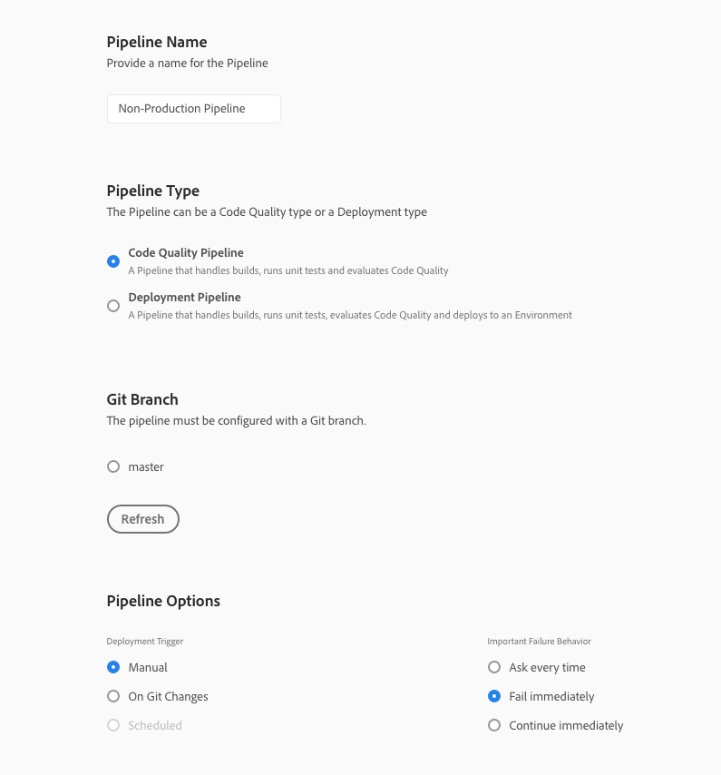

# Deploy Your First Project to AEM Cloud
In this scenario , we will deploy our locally generated project to AEM Cloud.

#### Cloud Manager

Cloud Manager is in charge of all orchestrations and deployments to the instances of the AEM Cloud Service.

* It is mandatory, and the only way to build, to test and to deploy the customer application both to the Author and the Publish services.


#### Pre-requisites
* Provisioned AEM Cloud Program 
* Access to Cloud Manager Git Repository

#### Pre-requisites Create a Project
1. Create a new project using the latest Archetype or have an existing project


### Step 1. Push your project code to Git Repository

1. Setup the git origin to Cloud Manager Git Repository URL
```
git remote add origin <Cloud Manager Git Repository SSH URL >
```
3. Add & Push the project to Git Repository

```
git add *
git add .gitignore
git commit -m "copy of showcase project"
git push --set-upstream origin master
```

### Step 2. Create a Non-Production Pipeline
1. Go to AEM Cloud Service **Programs** [URL]
2. Go to **Non-Production Pipeline** Card > Click Add 
3. Add Pipeline Name
4. Add **Pipeline Type** as **Code Quality Pipeline**
5. Select master **Git Branch** 
6. Select Pipeline Options **Manual**



### Step 3. Deploy the project
1. Hover over the created pipeline and click **Build**
2. Download and Inspect Logs


### Step 4. Verify Successful Deployment
1. Access Non-Prod Author Environment
2. Go to Sites > Project    
   
