

---

# Integrate Cloud Manager with an external system using Adobe I/O.

## Table of Contents

* Lesson 1 - Glitch Setup
* Lesson 2 - Webhook Setup
* Lesson 3 - Testing it Out
* Next Steps

### Scenario Roadmap

In this scenario, we'll be using a number of different tools, so before we get started, let's do a quick overview of what each of these tools does and how we will be using them.

* Cloud Manager
    *  In this scenatio, we'll be setting up a CI/CD pipeline in Cloud Manager and executing it a few times. 
*  Git
   * Git is a version control system. Every Cloud Manager customer is provided with a git repository. This scenario won't be teaching you the ins and outs of using git; just enough to get by. 
* Adobe I/O
    *  Adobe I/O is Adobe's centralized API Gateway through which customers and partners can integrate with the entire Adobe product portfolio. 
* Microsoft Teams
    * Microsoft Teams is a collaboration platform which includes chat (both group and one-on-one), voice, video, and other types of communication.

### Prerequisites

As a LiveTrial attendee, you have been provisioned with all of the necessary access and software needed to participate in this scenario. If you are using this workbook outside of the LiveTrial, you'll need the following:

* Access to Cloud Manager with the Deployment Manager role.
* The System Administrator role for your Organization in the Adobe Admin Console.
* A git client (either the command line client or as part of an Integrated Development Environment).

## Lesson 1 - Glitch Setup

### Objectives

* Setup a Glitch Account

### Lesson Context

In this lesson, we will set up a Glitch Account. [Glitch](https://glitch.com/about/) is a simple tool for creating Web Applications

1. Navigate to https://glitch.com/ 
2. Click ` Sign In `

     > 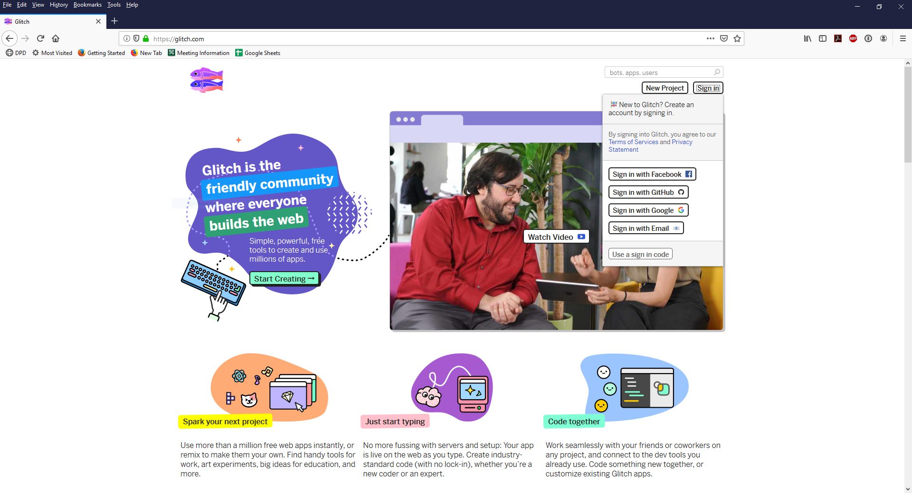

3. Select an appropriate Sign In option to create an account. For this exercise we are using ` Sign in with GitHub ` option

    > 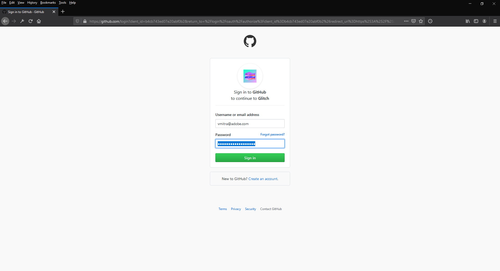

## Lesson 2 - Webhook Setup

### Objectives

1. Run a Simple Webhook
2. Expose the Webhook using Glitch

### Lesson Context

In this lesson, you will run a simple web application which illustrates the type of application typically run to receive events from Adobe I/O. You will also use a tool called [Glitch](https://glitch.com/) to deploy and expose the application to the public internet.

### Lesson 2.1: Setup Webhook

1. Click on bellow button to setup code the webhook within your Glitch Workspace.

  <!-- Remix Button -->

2. Webhook code should load up in the Glitch IDE
    > 

3. ` .env ` file defines the Environment Configuration i.e. the Client Id, Client Secret, Microsft teams API endpoint etc will be specified here
4. ` index.js ` contains the Webhook code. For more information on creating webhhoks please refer to https://github.com/AdobeDocs/cloudmanager-api-docs/tree/master/tutorial
5. ` package.json ` defines the build profiles and dependencies.
6. To test the Webhook, simply click the ` Show ` button and select ` In a New Window `

    > 

7. You should see an output like this

    > 

8. Copy the Webhook URL from the address bar and using CURL or Postman run: ` run curl -X POST <Webhook URL>/webhook `

     > 

9. You should see ` pong ` as the response.

### Lesson 2.2: Setup Adobe IO Integration

We now need to populate the first handful of lines in ` .env ` file. To do this, we will register an Integration in the Adobe I/O Console. Before doing that, we need to 

1. Run the following command in the Terminal Window or Command Prompt: 
    >   ` openssl req -x509 -sha256 -nodes -days 365 -newkey rsa:2048 -keyout private.key -out certificate.crt `

    > ` This command will generate a cryptographic certificate in order to securely sign requests to Adobe I/O. `

    > ` Retain the private.key and certificate.crt,  these will be used again for Scenario 11   `

    > 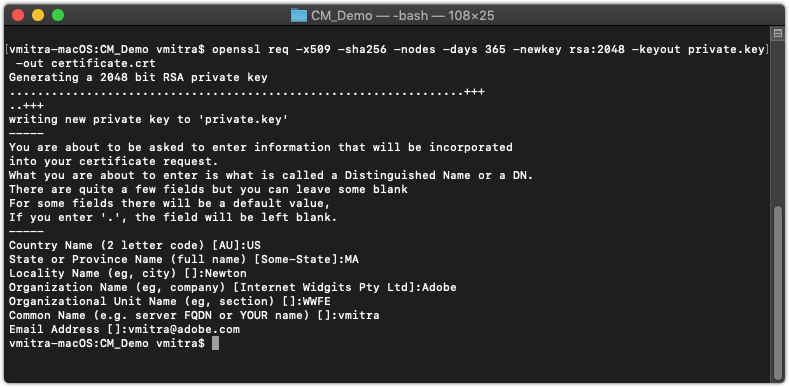

2. Log in to https://console.adobe.io/integrations 
3. Switch to the correct IMS organization
4. Click ` New integration `
    > 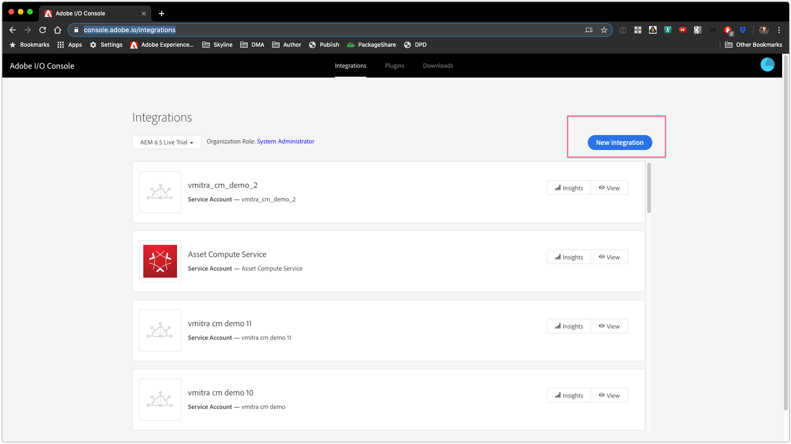

5. Select ` Access an API ` option and click ` Continue `
    > 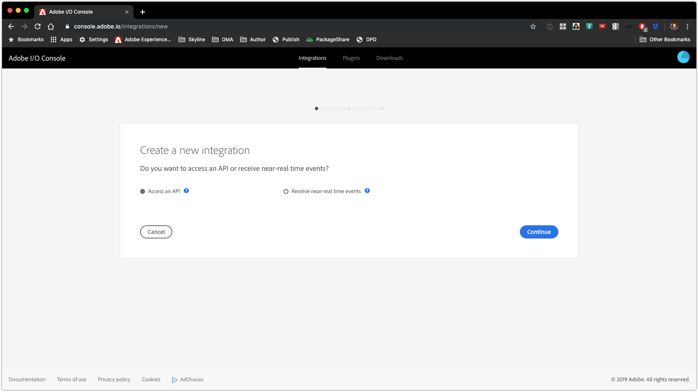

6. Select ` Cloud Manager ` and click ` Continue `
  > 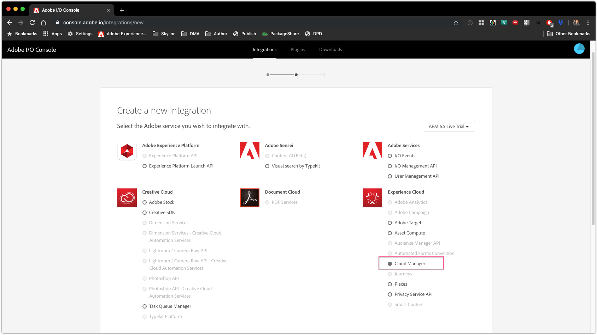

7. Specify:
    * Name
    * Description
    * Public keys certificates: ` Upload certificate.crt `
    * Product Profile: ` AEM Managed Services - Default Profile `
    > 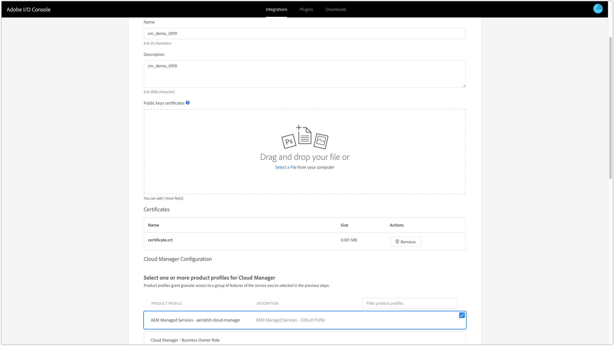

8. Click on ` Create Integration `.
9. Copy the values from ` Overview ` and Paste into the corresponding field in the ` .env ` file
    * ` API Key (Client ID) ` -> ` API_KEY `
    * `  Organization ID ` -> ` ORGANIZATION_ID `
    * ` Technical account ID ` -> ` TECHNICAL_ACCOUNT_ID `
    * ` Client secret ` -> ` CLIENT_SECRET `
    > 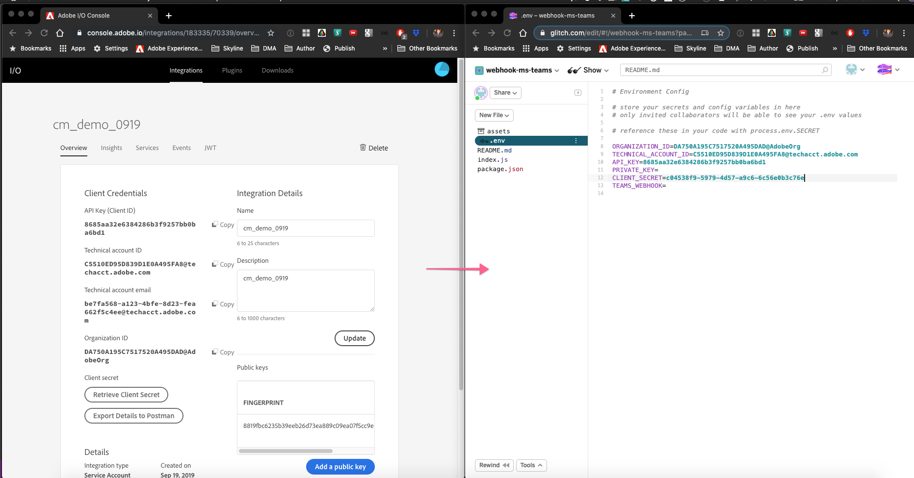

10. To copy the ` Private Key ` without any line breaks run the following command:

    > ` npm run clean-private-key | pbcopy `

    > Paste the private key into a notepad before specifying the values in ` .env ` file
11. ` .env ` file would look something like
    > 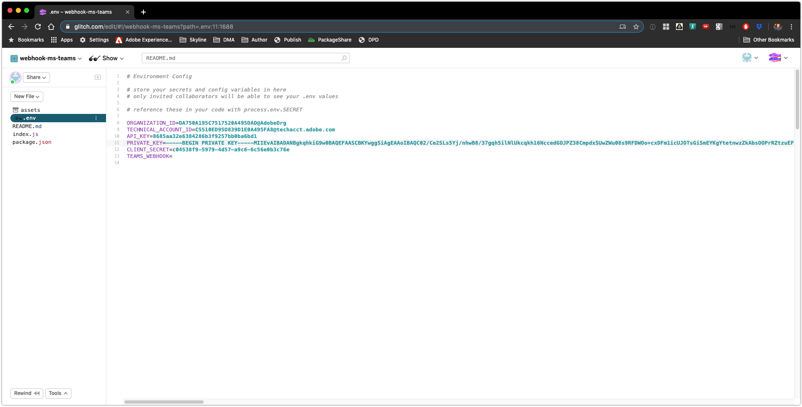

12. Navigate back to Adobe IO Console
13. Click ` Events ` Tab, Select ` Cloud Manager ` and Click ` Add Event Provider  `

     > 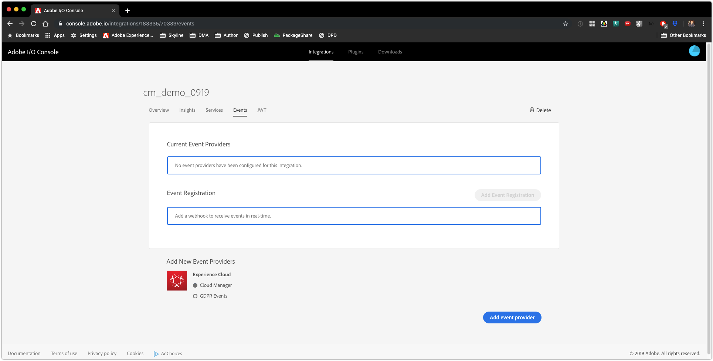

14. Click  ` Add Event Registration ` 
     > 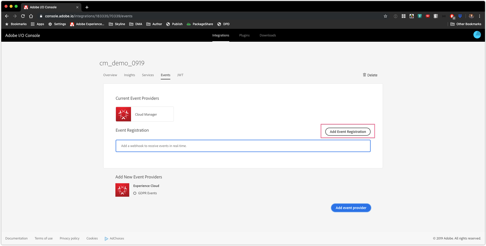
 
15. Set
    * Event Registration Name
    * Webhook URL ( optional ): ` <Webhook URL>/webhook `
    * Event Description
    * Select ` Pipeline Execution Started `
    * Event Delivery Method : ` One at a time `

    > 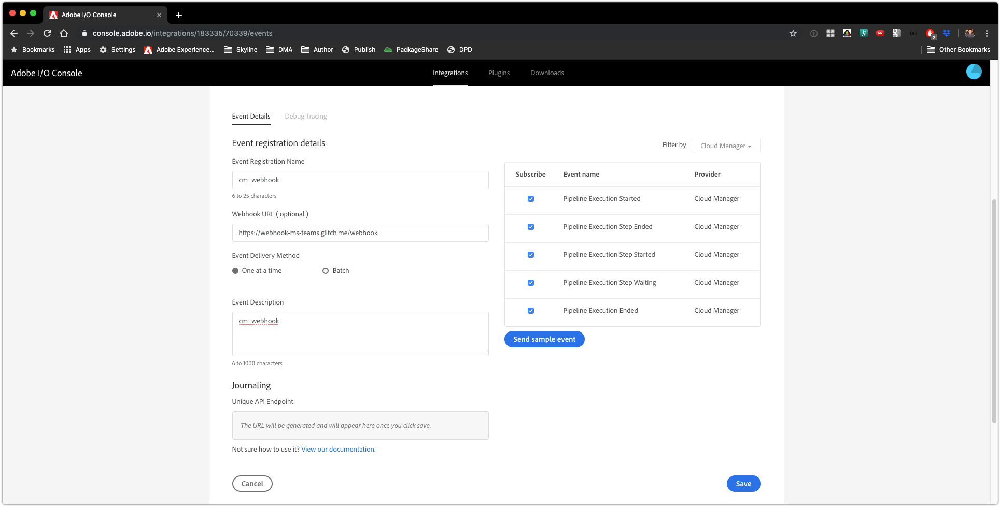

16. ` Save `. Webhook should get registered.

    > 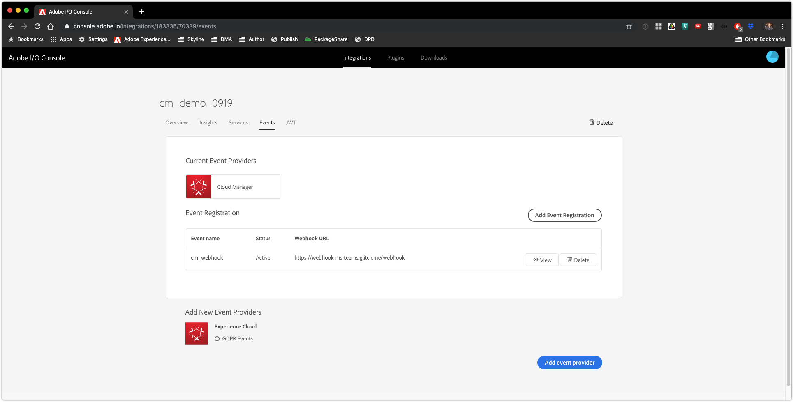

### Lesson 2.3: Setup Microsoft Teams

1. Download and Install [Microsoft Teams](https://products.office.com/en-us/microsoft-teams/download-app#desktopAppDownloadregion)
2. Join [AEM Livetrial](https://teams.microsoft.com/l/channel/19%3a5b863af592054aeeb1a626312d632c92%40thread.skype/General?groupId=c439f143-e41d-4170-bb84-ee0a79a7e846&tenantId=fa7b1b5a-7b34-4387-94ae-d2c178decee1) Team
3. To create an Incoming Webhook integration, click the Store icon.
    > 

4. Search for _incoming_ and click on _Incoming Webhook_.

    > 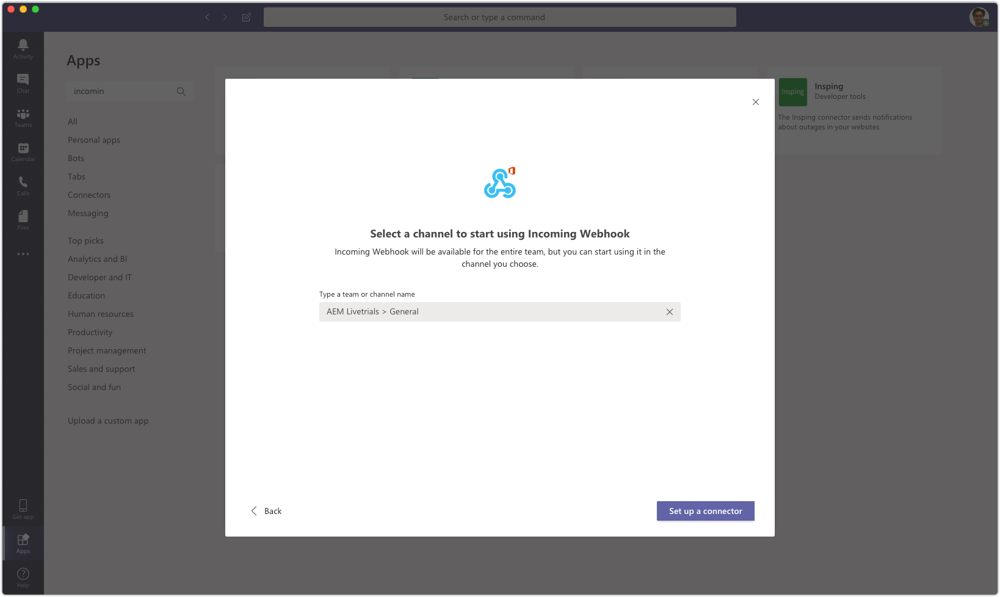 

5. Select ` AEM Livetrials > General ` as the team. Since the connector is already installed, click the _Available_ link.

    > 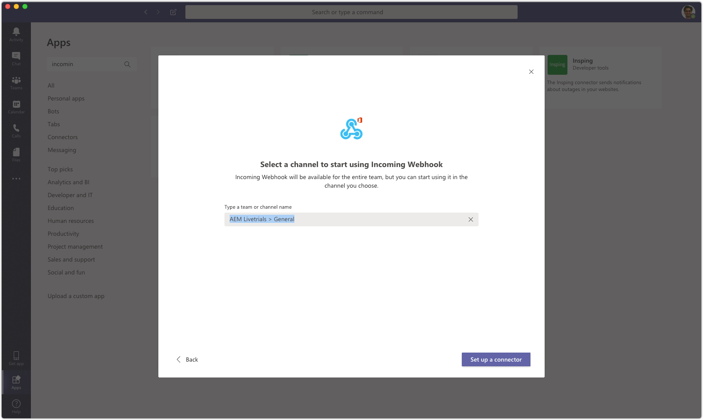

6. The webhook should send messages to the General channel by default. On the next screen, click _Set up_.

7. You need to provide a name for your webhook. Do this with a name based on your attendee number and click the _Create_ button.

    > 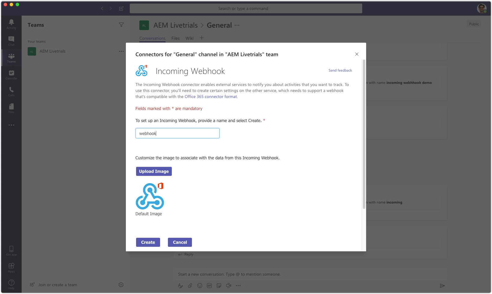

8. You will now see a URL (it will begin with `https://outlook.office.com/webhook/`). Click the button to copy this to the clipboard and click the _Done_ button.

    > 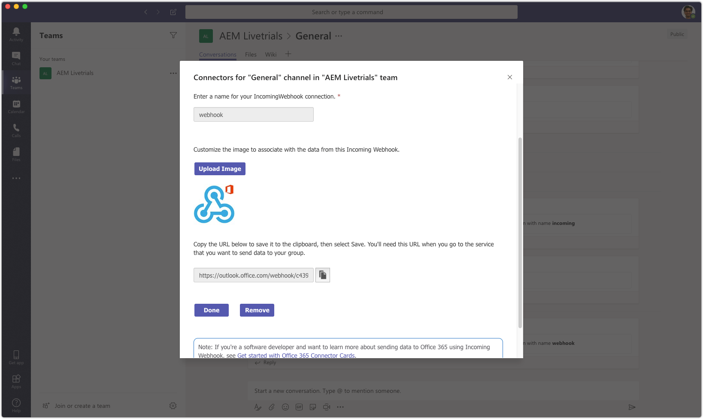

9. Now switch back to `Glitch` and paste the copied URL as the value of the `TEAMS_WEBHOOK` variable in the _.env_ file.

    > 

## Testing and Validation

Go back to Cloud Manager and Execute the pipeline. You should see a message like ` Update from Cloud Manager Execution for We.Retail Assets started `, in Microsoft Teams.

> 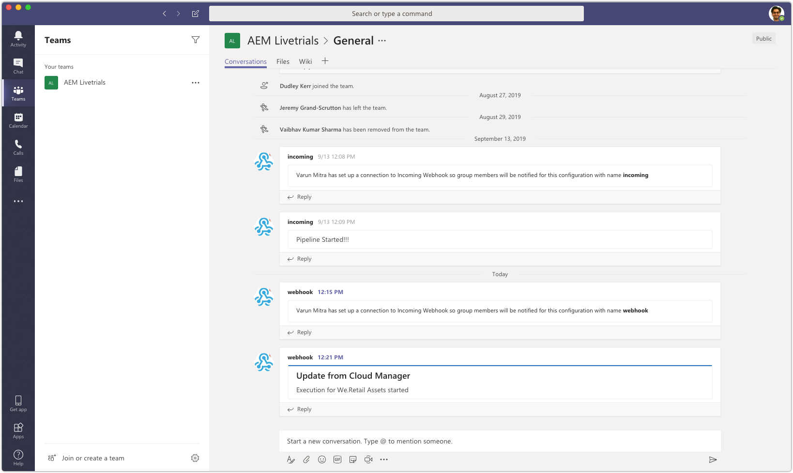
