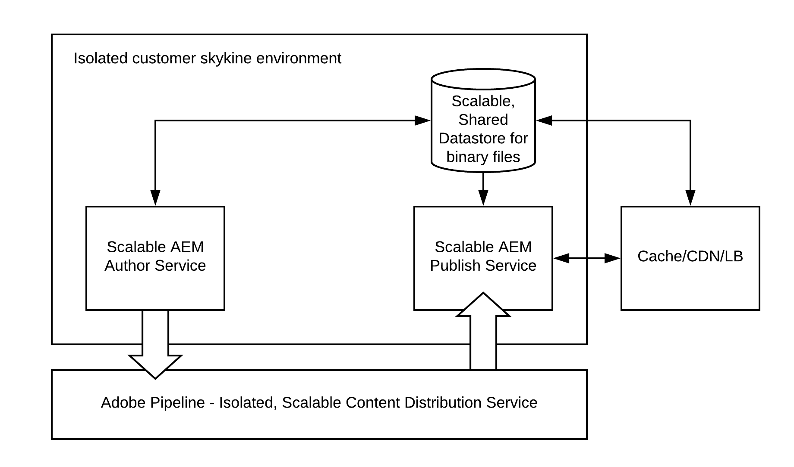
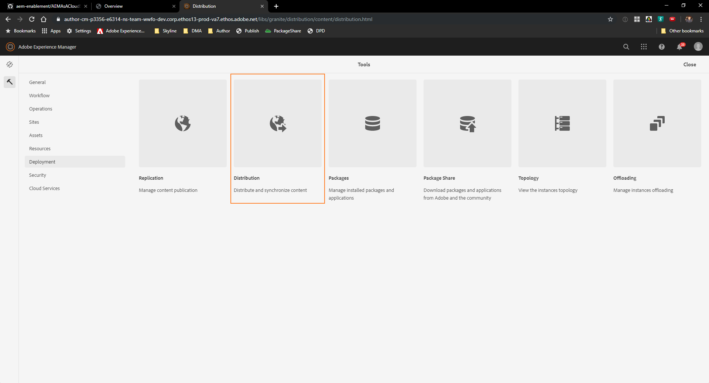
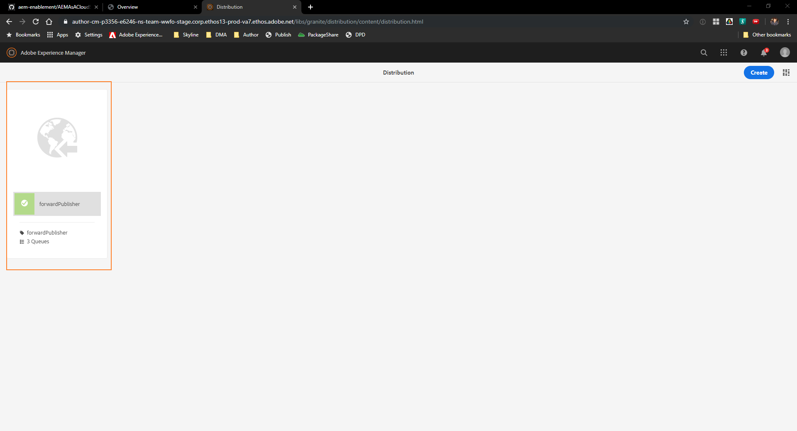
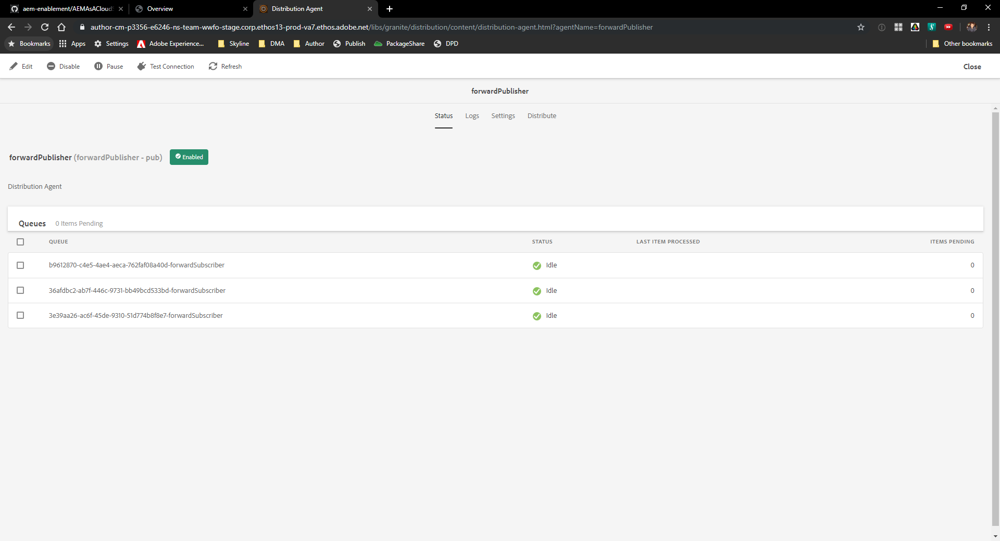
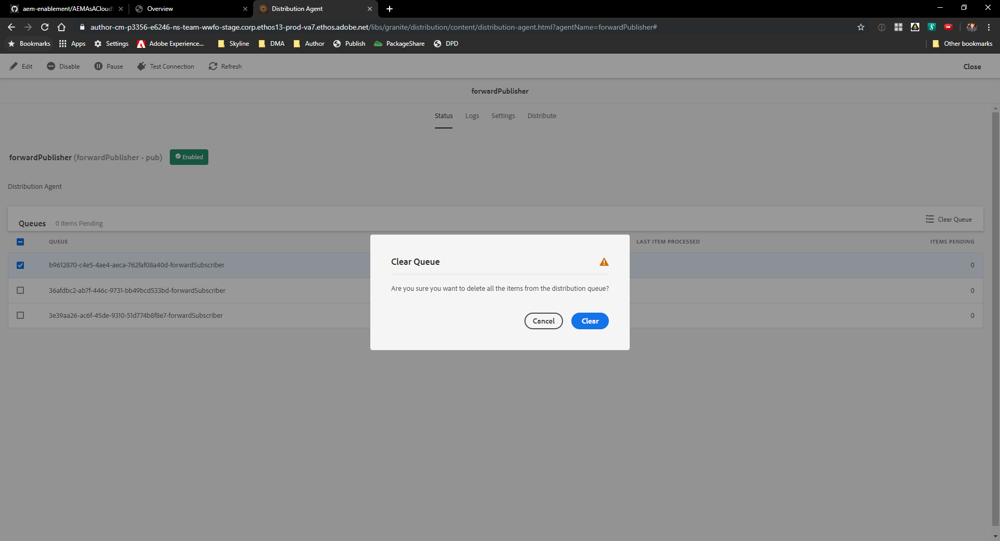
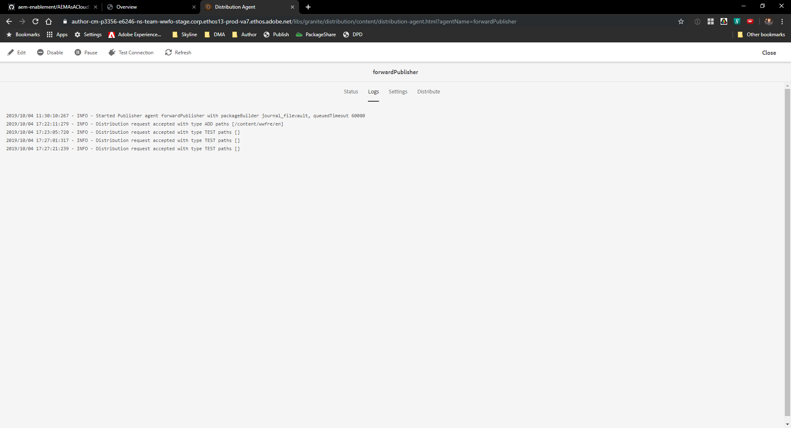
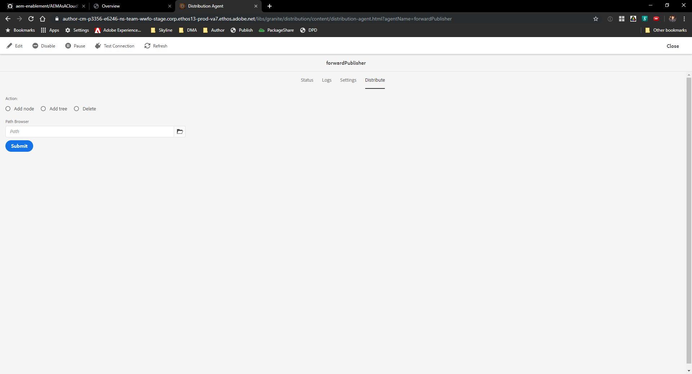
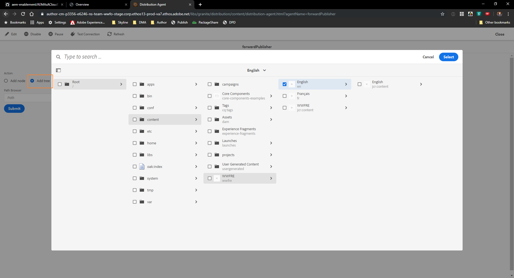
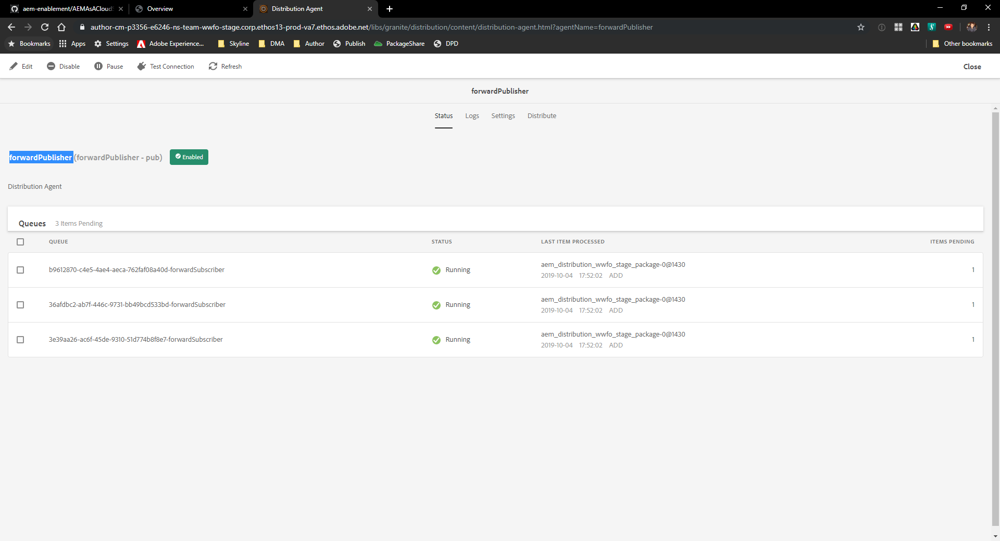

### Scenario Roadmap/Lesson Context

With AEM as a Cloud Service, the well known replication framework (used from 5.0-6.5) is no longer used to publish pages. Instead it uses the Distribution (Sling Content Distribution) capability to move the content to a pipeline service run on Adobe I/O that is outside of the AEM runtime. 

The setup is automated and also auto-configures itself during runtime when when publish or author nodes are added, removed or recycled. 

Publication/Unpublication is automatic, in that a single un/publication request will succeed for all resources in the AEM Publish Service, or fail for all. The resources within the AEM Publish Service will never be in a inconsistent state.

>   

In this lesson we will explore the Sling Content Distribution Framework

### Step 1. Use the content distribution framework

1. Navigate to ` Tools > Deployment > Distribution `

    > 

2. Click the ` forwardPublisher ` card

    > 

3. Verify the ` forwardPublisher  ` Content Distribution Agent's configuration 

    > 

4. Select one of the queue and click the  button

5. Click ` Clear `

    > 

6. Click on one of the queue to view the detailed status

    > 

7. Click on ` Logs ` Tab to view the log messages

    > 

8. Click on ` Distribute `

    > 

9. Select ` Add Tree ` and select a content path

    > 

10. Click ` Submit `

11. Verify the status for ` forwardPublisher ` agent by going back to the ` Status ` tab

  > 

12. Click on the ` Logs ` tab to verify the log messages

