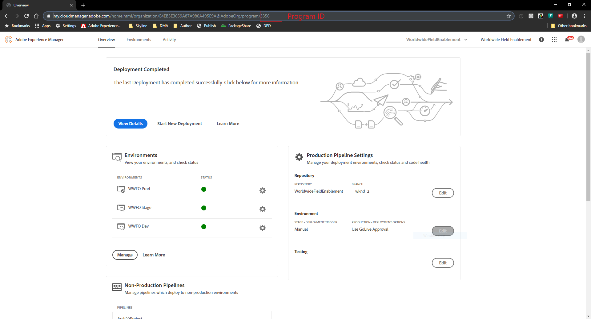
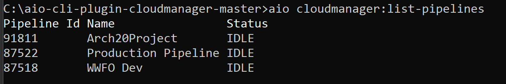
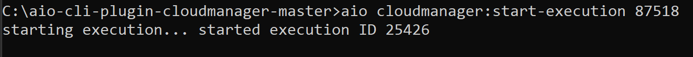

# Cloud Manager plugin for the Adobe I/O CLI

### Scenario Roadmap

In this scenario we will use Cloud Manager plugin for the Adobe I/O CLI to:

* Manage Non-Production Pipeline
* Trigger Pipeline Execution
* Access Log files for Skyline Environment
* View Information for Skyline Environment

#### Lesson Context

In order to setup Cloud Manager plugin for the Adobe I/O CLI, we will follow the below steps in the given order:

1. Set up Adobe IO CLI
2. Create Integration using Adobe IO Console
3. Set up Cloud Manager Plugin
4. Invoke Cloud Manager API

---

##### 1. Set Up Adobe IO CLI

1. Download/Clone the [Adobe IO CLI](https://github.com/adobe/aio-cli)
2. Navigate using command prompt to the downloaded directory
3. Run the following commands to install the AIO CLI
    > ` npm install `  
    > ` npm link `

    > 

    > ` npm install -g @adobe/aio-cli `
    > ` aio -v `

    > 

---

##### 2. Create Integration using Adobe IO Console

1. Navigate to https://console.adobe.io/integrations
2. Select the correct IMS Org 
3. Look up the integration created for [Scenario 3](./../03_CloudManager_API)
4. Download [config.json](./images/config.json)

> ` Place the file within the Adobe IO CLI directory `  

> 

5. Copy Client ID, Client Secret and JWT Payload from the Adobe IO Console and paste the value in ` config.json `

    >   
6. `config.json ` should look something like:
    > 
---
##### 3. Set up Cloud Manager Plugin

1. Run the following commands to install the Cloud Manager plugin for the Adobe I/O CLI:
    > ` aio plugins:install @adobe/aio-cli-plugin-cloudmanager `

2. Configure the credentials:

    > ` aio config:set jwt-auth PATH_TO_CONFIG_JSON_FILE --file --json ` 
    
    > e.g. ` aio config:set jwt-auth ./config.json --file --json `

3. Configure the path to private key generated in Scenario 3:
    > ` aio config:set jwt-auth.jwt_private_key PATH_TO_PRIVATE_KEY_FILE --file `

    > e.g. ` aio config:set jwt-auth.jwt_private_key ./private.key --file `

4. Set default Program ID:

    > aio config:set cloudmanager_programid PROGRAMID

    > e.g. ` aio config:set cloudmanager_programid 3356 `

    > 

5. Obtain the pipeline information
    > ` aio cloudmanager:list-pipelines `

    > 

6. Execute Pipeline

    > ` aio cloudmanager:start-execution PIPELINE_ID `

    > e.g. ` aio cloudmanager:start-execution 87518 `

    > 

7. Check the pipeline status through Cloud Manager.
8. Execute the commands listed at https://github.com/adobe/aio-cli-plugin-cloudmanager 

