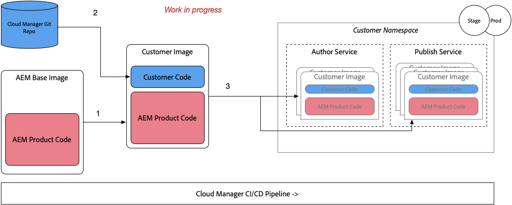
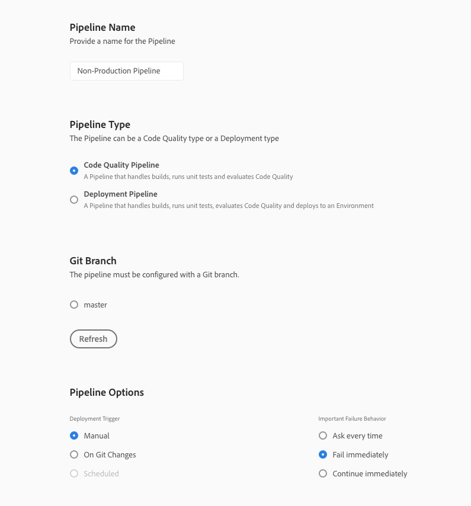

#### Cloud Manager

Cloud Manager is in charge of all orchestrations and deployments to the instances of the AEM Cloud Service.

* It is mandatory, and the only way to build, to test and to deploy the customer application both to the Author and the Publish services.



#### Configure Program 

### Step 1. Push your project code to Git Repository
1. Clone the WKND Project from repository
```
git clone ggit@github.com:Adobe-Marketing-Cloud/aem-guides-wknd.git
```

2. Setup the git origin to Cloud Manager Git Repo
```
git remote add origin
```
3. Push the project

```
git add *
git add .gitignore
git commit -m "copy of showcase project"
git push --set-upstream origin master
```
* [TBD] How Permission will be managed ??


### Step 2. Create A Non-Production Pipeline
1. Go to Adobe Experience Manager **Programs** [URL]
2. Go to **Non-Production Pipeline** Card > Click Add 
3. Add Pipeline Name
4. Add **Pipeline Type** as **Code Quality Pipeline**
5. Select master **Git Branch** 
6. Select Pipeline Options **Manual**



### Step 3. Deploy the project
1. Hover over the created pipeline and click **Build**
2. Download and Inspect Logs
   
   
