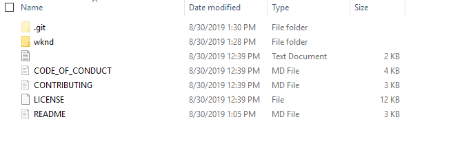
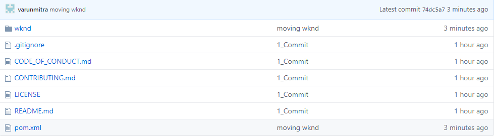
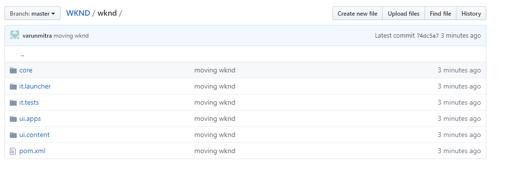
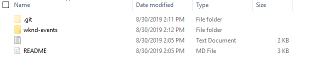
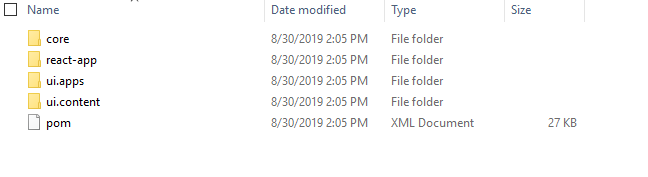

# AEM As A Cloud Service Livetrials 
## Merge Projects

#### Description
In this scenario we will combine the WKND and WKND-Events project. 
This scenario comprises of 3 parts:

| Serial  | Scenario |	Complexity	|
| ------------- | ------------- | ------------- |	
| 1  | Clone and Format WKND Project  |	Medium	|
| 2  | Clone and Format WKND-Events Project  |	Low	|
| 3  | Merge WKND and WKND-Events Project    |  High|

#### Pre-requisites
1. github.com account or a GIT repository on https://git.corp.adobe.com
2. [git](https://git-scm.com/downloads) command line or [GitHub Desktop](https://desktop.github.com/)
3. Cloud Ready Adobe Experience Manager
4. Apache Maven (3.3.9 or newer)
5. Adobe Public Maven Repository in maven settings 

#### Scenario 2
#### 2a. Clone WKND Project
1. Clone [WKND Sites Project](https://github.com/adobe/aem-guides-wknd/tree/solution/chapter-8)
    > ` git clone --branch solution/chapter-8 https://github.com/adobe/aem-guides-wknd.git `

2. Set up an empty Git Repository 
    > ` This GIT repository will be referred to as Origin `
3. Open Command Prompt or Terminal Window.
4. Navigate using command line to the local directory that contains cloned WKND Project
5. Execute the following commands, to delete the `.git` folder
    * Windows:
      > rmdir .git /S
    * Mac
      > rm -R .git
6. Initialize the local repository and point it to remote `Origin` GitHub
    > ` git init `

    > ` git add . ` 
    
    > ` git commit ` 
    
    > ` git remote add origin <http URL for the origin git> `   
    > e.g.  ` git remote add origin https://github.com/varunmitra/WKND.git `
    
    > ` git push -f origin master `

---

#### 2b: Format WKND Project

1. Navigate using command line to the local directory that contains cloned WKND Project
2. Create a new directory 
    > ` mkdir wknd `
3. Move projects and files inside the newly created directory
    > ` git mv pom.xml core it.launcher it.tests ui.content ui.apps wknd `
4. Resulting folder structure will look like:

    > 

5. Create a new `pom.xml` file. 
6. Update the `pom.xml` file with the following [code](https://git.corp.adobe.com/gist/vmitra/24c136f38b8d9e6597b14dca917a22a2)
7. Add `pom.xml` to the current project
    > ` git add pom.xml`
8. Test project sanity by running `mvn verify`
9. Commit the `GIT` Changes
    > ` git commit -m "moving wknd" `
10. Push the latest changes to Remote Origin GitHub
    > ` git push -f origin master `
11. Resulting GitHub will look something like:

    >  
    
    
#### 2c: Clone WKND-Events

1. Clone [WKND-Events Sites Project](https://github.com/Adobe-Marketing-Cloud/aem-guides-wknd-events/tree/react/chapter-3)
    > ` git clone --branch react/chapter-3 https://github.com/Adobe-Marketing-Cloud/aem-guides-wknd-events.git `

2. Set up an empty Git Repository 
    > ` This GIT repository will be referred to as Origin `
3. Open Command Prompt or Terminal Window.
4. Navigate using command line to the local directory that contains cloned WKND-Events Project
5. Execute the following commands, to delete the `.git` folder
    * Windows:
      > rmdir .git /S
    * Mac
      > rm -R .git
6. Initialize the local repository and point it to remote `Origin` GitHub
    > ` git init `

    > ` git add . ` 
    
    > ` git commit ` 
    
    > ` git remote add origin <http URL for the origin git> `   
    > e.g.  ` git remote add origin https://github.com/varunmitra/WKND-Events.git `
    
    > ` git push -u origin master `

---

#### 2d: Format WKND-Events Project

1. Navigate using command line to the local directory that contains cloned WKND Project
2. Create a new directory 
    > ` mkdir wknd-events `
3. Move projects and files inside the newly created directory
    > ` git mv pom.xml core ui.content react-app ui.apps wknd-events `
4. Resulting folder structure will look like:

    >   

5. Create a new `pom.xml` file. 
6. Update the `pom.xml` file with the following [code](https://git.corp.adobe.com/gist/vmitra/5467d0478ac2d2fa07f7630d8e9a4c0a)
7. Add `pom.xml` to the current project
    > ` git add pom.xml`
8. Test project sanity by running `mvn verify`
9. Commit the `GIT` Changes
    > ` git commit -m "moving wknd-events" `
10. Push the latest changes to Remote Origin GitHub
    > ` git push -u origin master `
11. Resulting GitHub will look something like:

    >  
    
    
