<div class="aem-logo"></div>
<div class="adobe-logo"></div>

---

# Get Up, Running, and Integrated with Cloud Manager for Experience Manager

## Table of Contents

* [Lab Overview](#lab-overview)
* [Lesson 1 - Pipeline Setup](#lesson-1---pipeline-setup)
* [Lesson 2 - Pipeline Execution](#lesson-2---pipeline-execution)
* [Lesson 3 - Fixing Issues](#lesson-3---fixing-issues)
* [Lesson 4 - Create a Webhook](#lesson-4---create-a-webhook)
* [Lesson 5 - Webhook Setup](#lesson-5---webhook-setup)
* [Lesson 6 - Testing it Out](#lesson-6---testing-it-out)
* [Next Steps](#next-steps)
* [Additional Resources](#additional-resources)

## Scenario Overview

Welcome to the scenario "Get Up, Running, and Integrated with Cloud Manager for Experience Manager"! In this scenario, we will look at how Cloud Manager helps our customers and partners quickly deploy their custom applications to Adobe-managed Experience Manager environments while ensuring that custom code adheres to both Adobe and industry best practices. We will also explore how external systems (in this case Microsoft Teams) can be integrated with Cloud Manager using our API.

Cloud Manager, first introduced at Summit 2018, is a self-service cloud application which enables our Managed Services customers to deploy, update, monitor, and manage their Experience Manager environments. This lab will be focused on the Continuous Integration / Continuous Delivery (CI/CD) aspect of Cloud Manager. There are other sessions at Summit which address some of the other capabilities of Cloud Manager as well as full reference documentation linked to from the [Additional Resources](#additional-resources) section below.

### Key Takeaways

* Learn how to set up a CI/CD pipeline in Cloud Manager.
* See how Cloud Manager identifies coding errors.
* Integrate Cloud Manager with an external system using Adobe I/O.

### Scenario Roadmap

In this scenario, we'll be using a number of different tools, so before we get started, let's do a quick overview of what each of these tools does and how we will be using them.

* Cloud Manager
    *  In this scenatio, we'll be setting up a CI/CD pipeline in Cloud Manager and executing it a few times. Cloud Manager will be used in Lessons 1, 2, 3, and 6.
*  Git
   * Git is a version control system. Every Cloud Manager customer is provided with a git repository. This scenario won't be teaching you the ins and outs of using git; just enough to get by. Git will be used in Lesson 3.
* Adobe I/O
    *  Adobe I/O is Adobe's centralized API Gateway through which customers and partners can integrate with the entire Adobe product portfolio. Adobe I/O will be used directly in Lesson 5.
* Microsoft Teams
    * Microsoft Teams is a collaboration platform which includes chat (both group and one-on-one), voice, video, and other types of communication. In this lab, we are using Microsoft Teams as a notification channel in Lessons 5 and 6.


The last item in this picture is a webhook. This is a small piece of software which you'll be configuring, running, and (if you want) modifying which will act as a notification broker between Adobe I/O and Microsoft Teams. Your webhook (created in Lesson 4) will receive notifications _from_ Adobe I/O and then send notifications _to_ Microsoft Teams. In addition to receiving notifications from Adobe I/O, the webhook will make API calls _to_ Adobe I/O to augment the information provided in the initial notification.

### Prerequisites

As a LiveTrial attendee, you have been provisioned with all of the necessary access and software needed to participate in this scenario. If you are using this workbook outside of the LiveTrial, you'll need the following:

* Access to Cloud Manager with the Deployment Manager role.
* The System Administrator role for your Organization in the Adobe Admin Console.
* A git client (either the command line client or as part of an Integrated Development Environment).

## Lesson 1 - Pipeline Setup

### Objectives

1. Log into Cloud Manager
2. Create a Code Quality Pipeline

### Lesson Context

This lesson will start by logging into Cloud Manager through the Experience Cloud. Once logged in, you will create a simple CI/CD pipeline which builds an application project and evaluates the code quality. Pipelines like this can be used throughout the development process to get early and fast feedback.


#### Exercise 1.1

Our lab starts with logging into the Cloud Manager web interface. To start, open Google Chrome. It should automatically present you with the Experience Cloud login page. If not, navigate to https://aem65lt.experiencecloud.adobe.com.

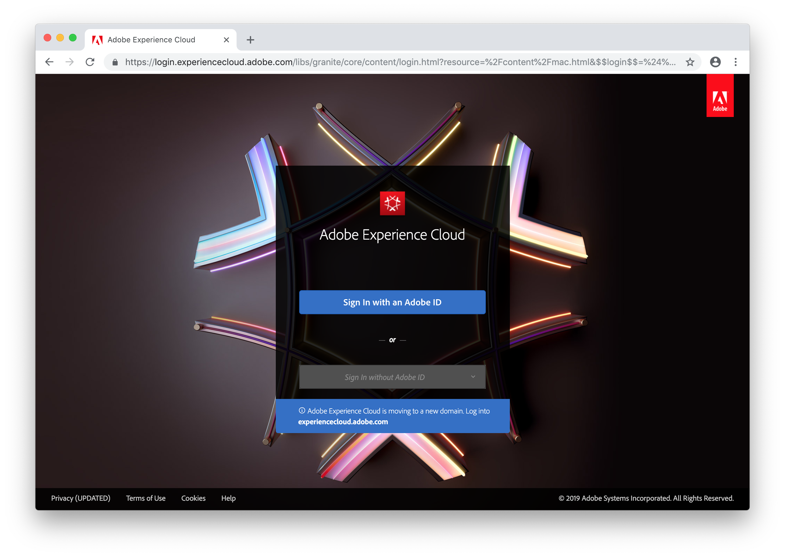

On this page, click the _Sign In with an Adobe ID_ button.

Each attendee has a unique login assigned to them. You should see this on your workstation. Enter that email address and password on the login form and click the _Sign in with an Enterprise ID_ button.

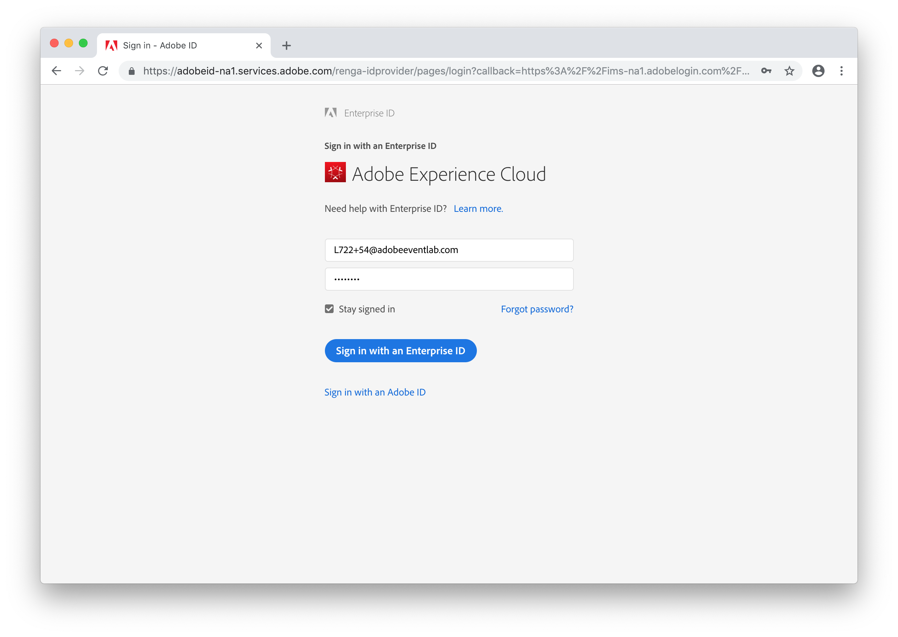

To navigate to Cloud Manager, click the Solution Switcher in the header navigation (the icon is three rows of three squares) and select Experience Manager.

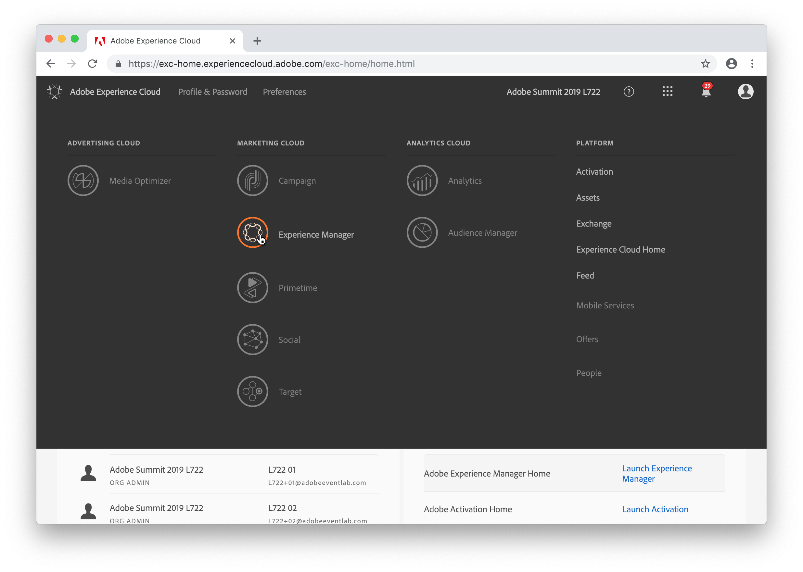

On this screen, click the _AEM Managed Services_ card.

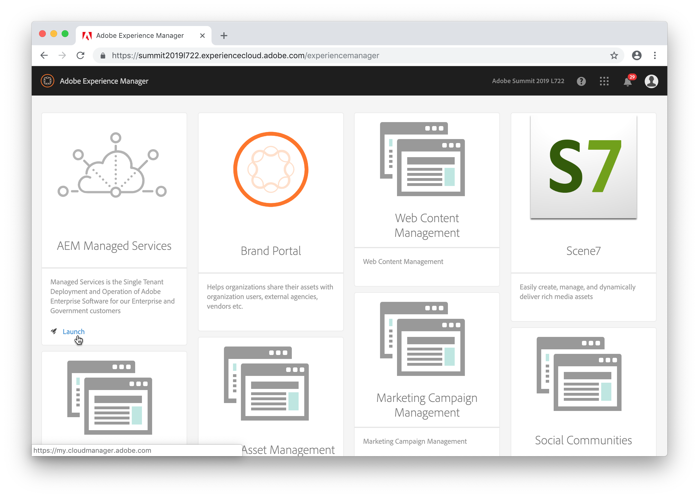

We refer to this screen as the _Program Switcher_. Many of our Managed Services customers have multiple _programs_ under a single enterprise organization. For example, you might have one set of environments for an Enterprise DAM, another set for your public-facing websites, and another set for an employee or partner portal. Cloud Manager groups these into separate programs. For the purpose of this lab, we only have a single program (We.Retail Intranet). To navigate to the Cloud Manager overview page for that program, hover over the card and click on the Cloud Manager icon (it will be the first icon on the left).

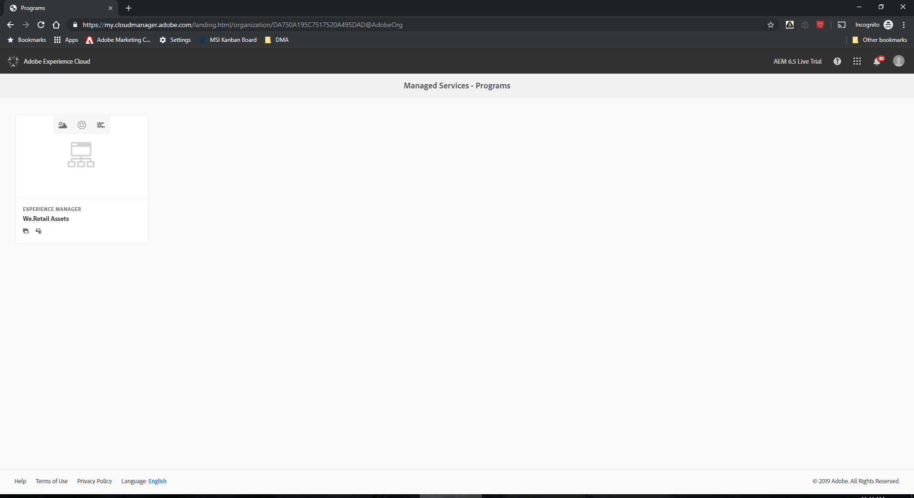

> If you click on the card itself, you will get an error message stating that the AEM Link cannot be found. Under normal circumstances, clicking on the card will navigate to the production AEM author instance. For the purpose of this lab, there is no production author instance, so this link is non-functional.

#### Exercise 1.2

Cloud Manager supports multiple types of CI/CD pipelines. The _primary_ pipeline builds a customer application project, runs a series of code quality checks, deploys that project to a staging environment, runs security and performance tests, and finally deploys to the production environment. Additional pipelines may be created to deploy to other non-production environments, e.g. a development environment. There is also support for what we refer to as "Code Quality Only" pipelines which only execute the build and code quality checks. These pipelines are useful to verify code quality during a development cycle and are especially relevant for customers who do not have a separate development environment hosted by Adobe.

For the purpose of this lab, we will be using a Code Quality Only pipeline primarily for the purpose of speed -- it does the least and thus takes the least amount of time.

> That said, if you are using this workbook outside of Summit and have the environments available, feel free to use a different pipeline type; it doesn't actually impact the lab content significantly.

To start, click the Add button in the Non-Production pipelines card.

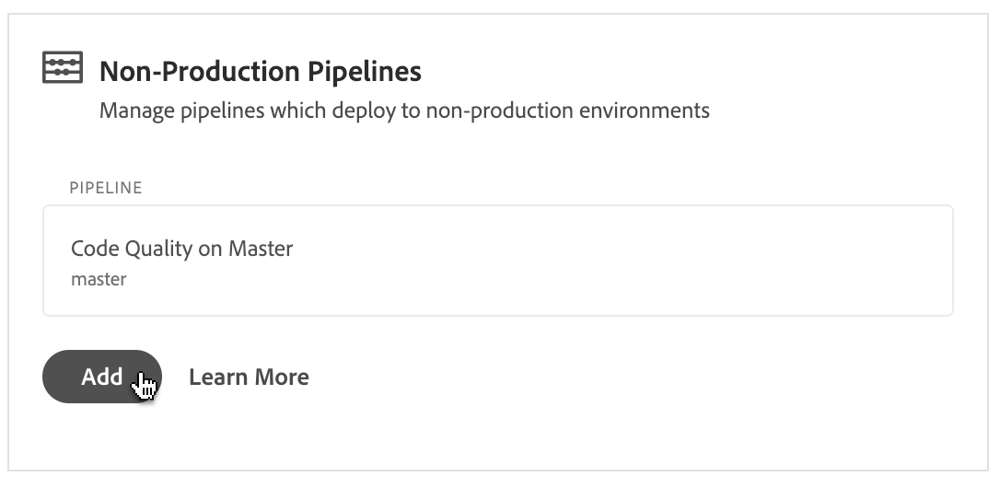

Provide a name for your pipeline which includes your attendee number. For example, if your attendee number is `5`, name it `Pipeline 5`. Make sure that _Code Quality Pipeline_ is the selected Pipeline Type (it should be the only option available).

The git repository for this program has been set up with 100 branches, one for each attendee. This is not really typical -- most programs only have a handful of branches. Select the branch which corresponds to your attendee number.

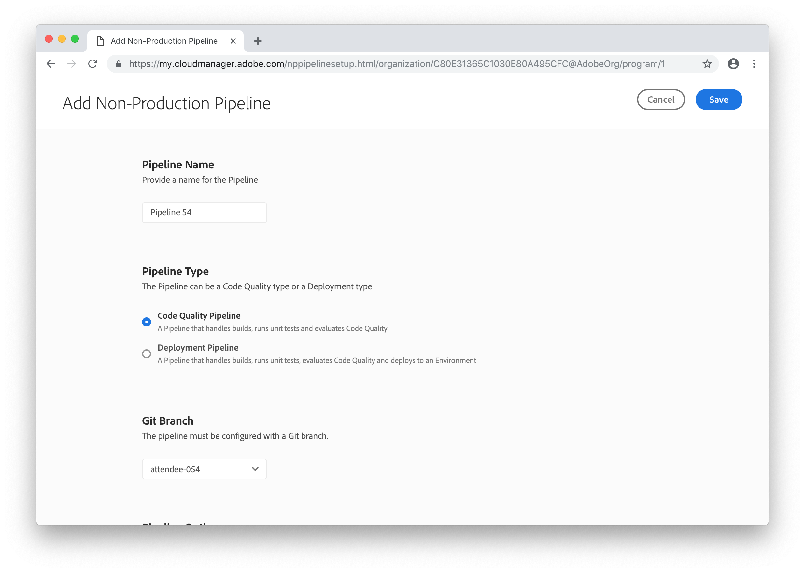

Finally, make sure that the Manual trigger is selected under the Pipeline Options section and that the Important Failure Behavior is set to Fail immediately.

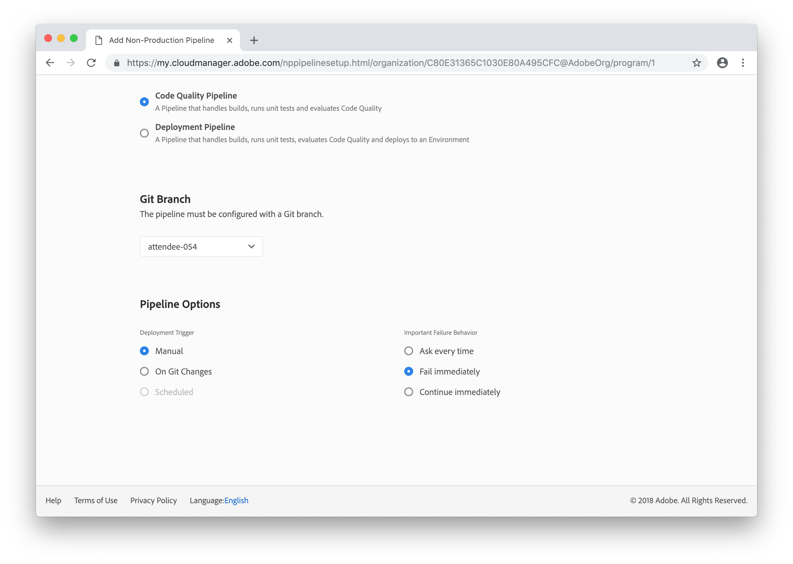

Finally, click the Save button in the top right corner.

## Lesson 2 - Pipeline Execution

### Objectives

1. Execute the Pipeline
2. Understand the Results

### Lesson Context

In this lesson, we will execute the pipeline created in the first lesson and observe the results in both summarized and detailed form.

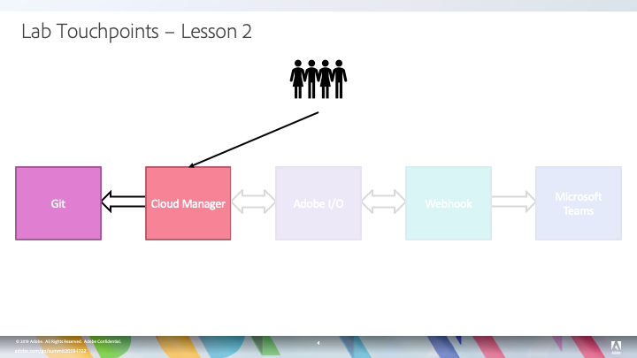

#### Exercise 2.1

Now that we have our pipeline setup, it is time to execute it.

You should be back on the Cloud Manager Overview page. If not, click the Overview link in the top navigation.

In the Non-Production Pipelines box, find the pipeline you created in the first step. Hover over the row in the table and click the _Build_ button. This will take you to the Pipeline Execution page.

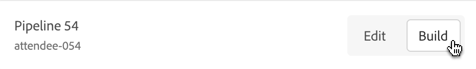

On the Pipeline Execution page, click the _Build_ button to start the pipeline.

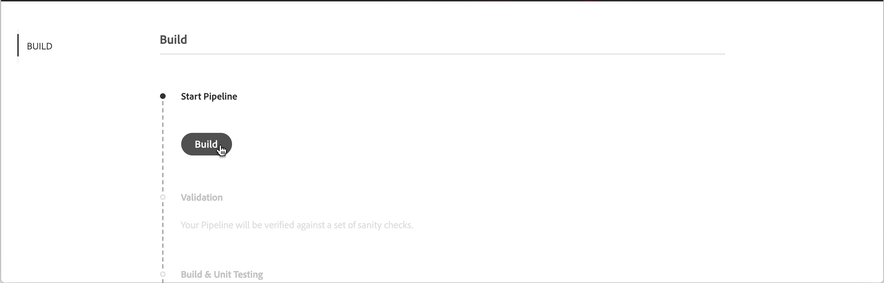

> This will take a little time, so grab something to drink.

#### Exercise 2.2

Uh oh. The pipeline failed. Let's see why. Looking at the execution details screen, you'll see that the Code Quality step has failed. Click on the Review Summary button to open the summary dialog.

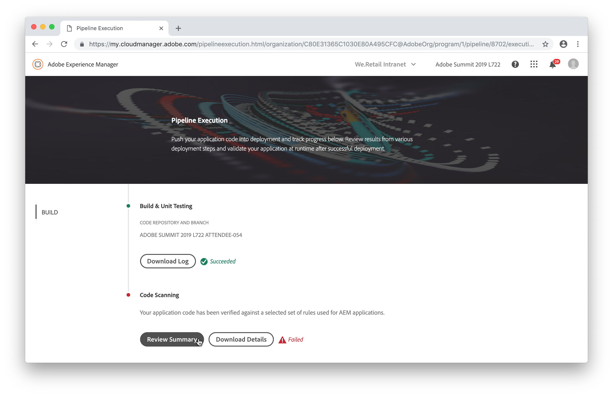

The Code Quality, Security Testing, and Performance Testing steps in Cloud Manager all follow a three-tier structure -- the step produced a variety of metrics and these are classified as either _Critical_, _Important_, or _Informational_. If a Critical metric has not met its threshold, the execution fails immediately. If an Important metric has not met its threshold, the execution is paused (by default, although in this case, we specified the pipeline should fail immediately since it is a Code Quality-only pipeline) until someone overrides or rejects the violation. And Informational metrics are purely Informational.

> The Security Test step is slightly different in that each "metric" is actually a separate Health Check and either passes or fails, but the same three-tier concept applies.

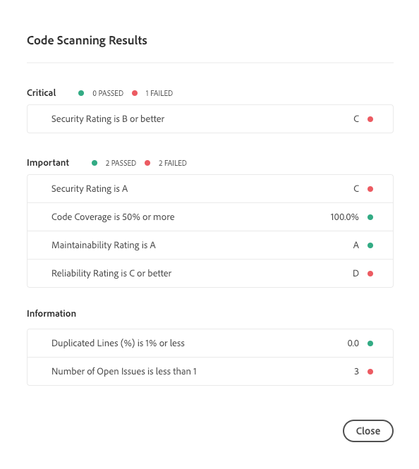

In this case, we actually have two problems -- the Security Rating is a C and the Reliability Rating is a D. The Reliability Rating is an Important metric, so we could override that, but the Security Rating is Critical so we must fix that in order to proceed. So let's do that. Click the Close button to dismiss the dialog.

Cloud Manager provides a spreadsheet listing the specific coding rule violations which led to the metrics. We'll need that for the next lesson, so click the Download Details button to download it.

The resulting download should open automatically in Microsoft Excel, but if not, go ahead and open it. There will be four rows in the spreadsheet -- a heading row and one row for each of the three violations identified in the project. You may want to adjust the columns for readability.

## Lesson 3 - Fixing Issues

### Objectives

1. Checking out the Project Code
2. Updating the Project Code
3. Re-Executing the Pipeline

### Lesson Context

Building on the prior lesson, in this lesson you will download a copy of the codebase built by the Cloud Manager pipeline set up in the first lesson and executed in the second lesson and attempt to resolve the problems identified during the pipeline execution.

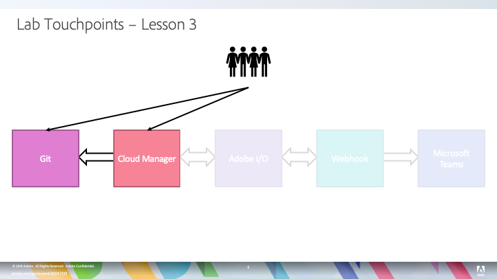

#### Exercise 3.1

Now that Cloud Manager has told us where the problems in our code lie, let's go ahead and fix them.  To do this, you will clone the Cloud Manager-provided git repository for this program and make your changes on your branch.

In order to connect to the git repository, you will need a URL, username, and password. These can be found in a file named _git_credentials.txt_ on the Desktop. Open this file in TextEdit.

In this lab, we will be using Microsoft Visual Studio Code as our Integrated Development Environment, but if you are doing this lab on your own, you can use any IDE. To start, open Visual Studio Code. Select _Command Palette_ from the _View_ menu and type _Git: Clone_. Copy and paste the URL from the text file and press _Enter_.

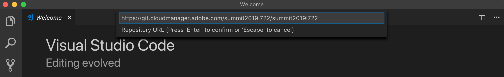

When prompted, select your _Documents_ folder and click _Select Repository Location_. Visual Studio Code will automatically create a folder inside the selected folder.

Visual Studio Code will now prompt you for the username and password. As with the URL, copy and paste these values from the text file and press _Enter_.

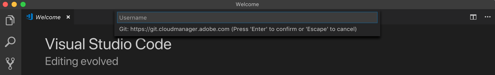

Once the clone operation is complete, Visual Studio Code will prompt you to open the cloned repository. Click the _Open Repository_ button.

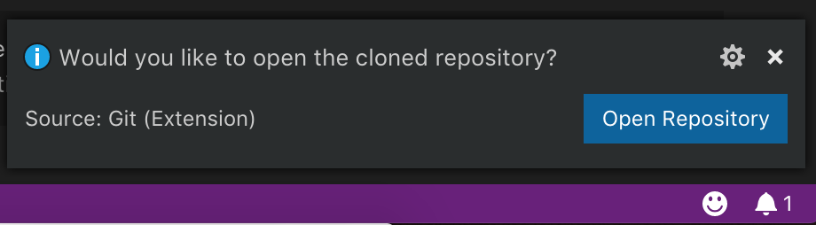

Your Visual Studio Code window should now look like this:

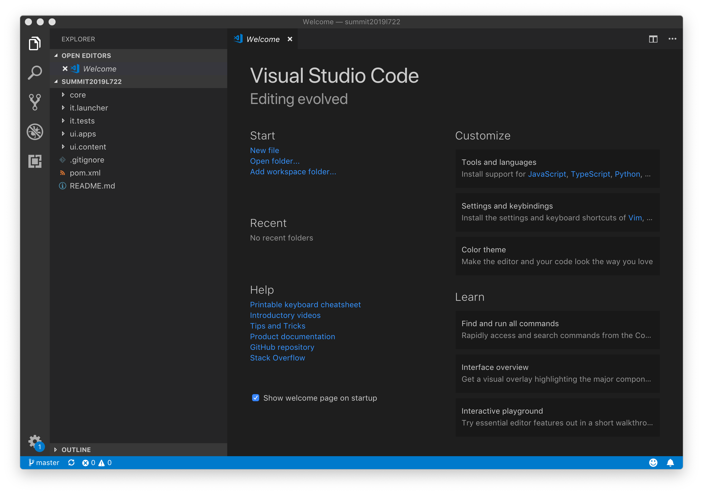

The last thing you need to do before editing code is to checkout your specific branch. As mentioned in [Exercise 1.2](#exercise-12), each attendee has their own branch. To checkout your branch, open the Command Palette and select _Git: Checkout to..._.

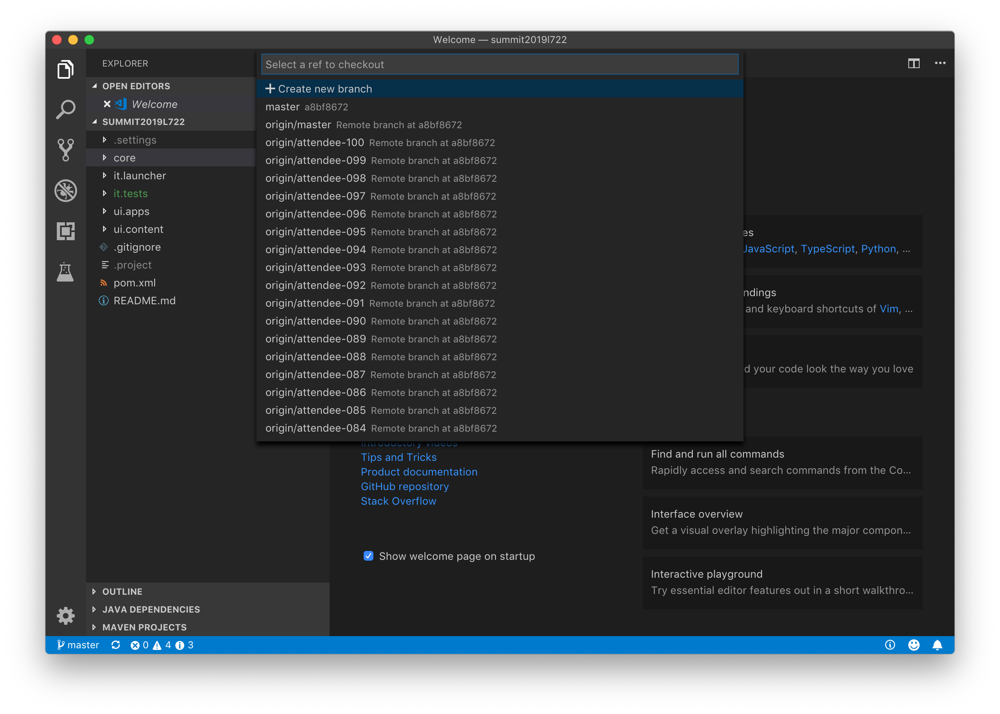

Select your branch and press _Enter_.

In Visual Studio Code, the current branch is shown in the bottom left-hand corner. Confirm that the proper branch has been selected.

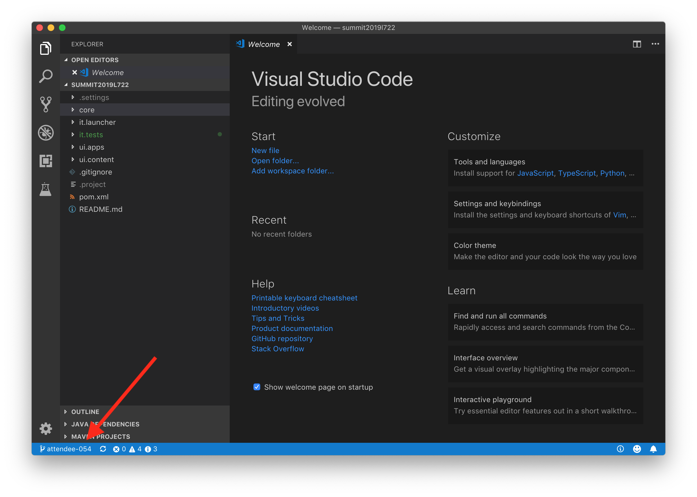

#### Exercise 3.2

Now that the code is checked out, the two issues identified by Cloud Manager can be fixed. Based on the spreadsheet, you can see that the issues are in the files named _NotFoundResponseStatus.java_ and _SimpleServlet.java_.

To easily open these files, open the _Go_ menu and select _Go to File..._. Then enter the file name.

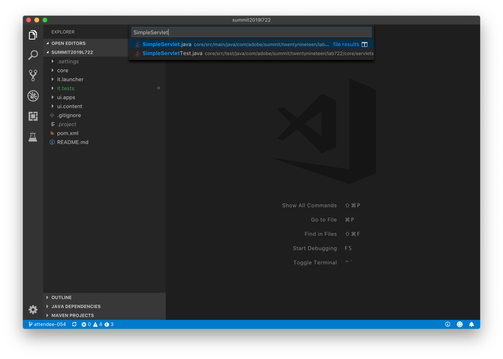

For both files, the fixes are in the source file, just commented out. Follow the inline instructions as to which lines to add comments to and which lines to uncomment. After making the directed changes, _NotFoundResponseStatus.java_ should look like this:

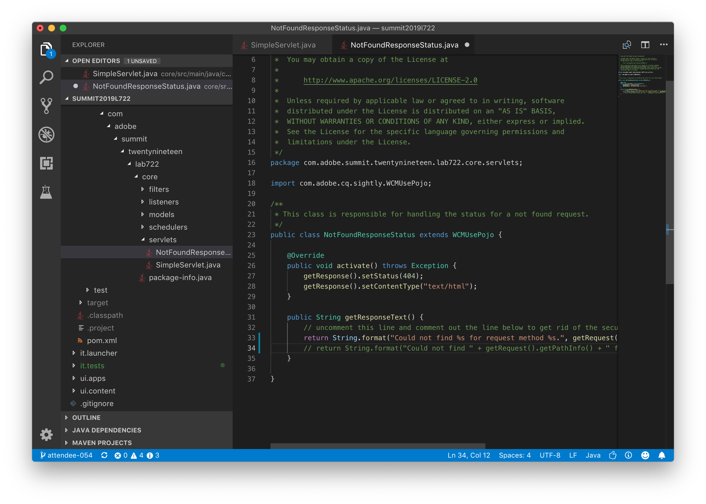

And _SimpleServlet.java_ should look like this:

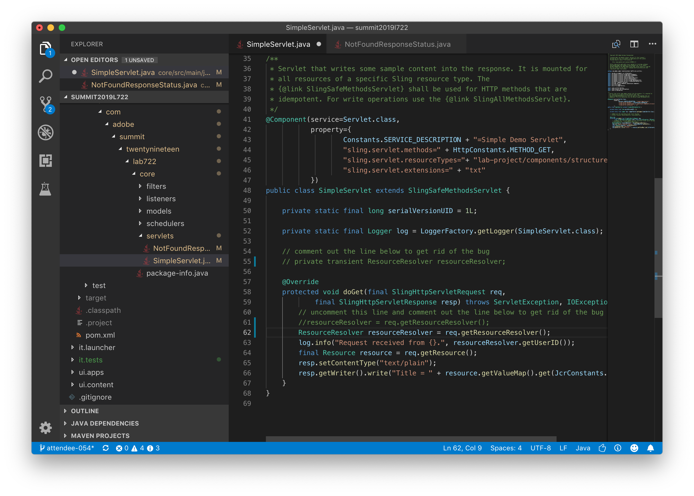

Remember to save both files.

These changes now need to be committed to the git repository. Open the Command Palette and select _Git: Commit All_. You'll be prompted to first stage your changes. Click the _Yes_ button.

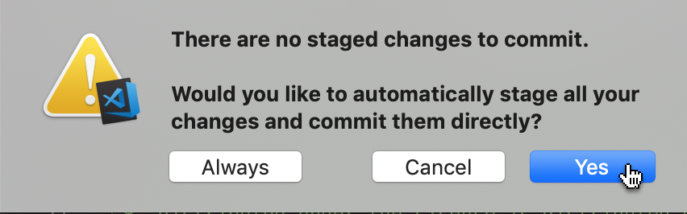

You'll then be prompted for a commit message. Type some useful message and press _Enter_.

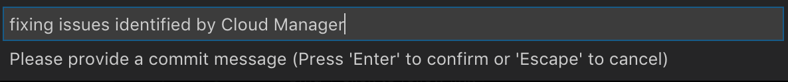

Finally, to push this commit to the Cloud Manager git repository, open the Command Palette again and select _Git: Push_.

#### Exercise 3.3

With the fixes to the issues committed and pushed, the pipeline should successfully execute. To try this, go back to the web browser, navigate to the Cloud Manager Overview page, find your pipeline and build it again.

## Lesson 4 - Create a Webhook

### Objectives

1. Run a Simple Webhook
2. Expose the Webhook using ngrok

### Lesson Context

> NodeJS is required for this lesson. Please install it if you haven't done so.

In this lesson, you will run a simple web application which illustrates the type of application typically run to receive events from Adobe I/O. You will also use a tool called [ngrok](https://ngrok.com/) to expose that application to the public internet.


#### Exercise 4.1

The next two lessons are focused on how to use the Cloud Manager API and Adobe I/O to receive notifications from Cloud Manager when the pipeline starts. To do this, we will create a _webhook_. A webhook is simply a small web application which receives a request from a service when something has happened. In this case, Adobe I/O will invoke the webhook on any pipeline event -- when the pipeline starts, when it ends, when individual steps start and end, etc.

The bulk of the webhook has already been written and in the next lesson we will be configuring the webhook, but before we get to the real webhook implementation, let's start by running a very simple webhook. 

To start this: 
1. Go back to Visual Studio Code. 
2. Open the _File_ menu and select _Open Folder..._. 
3. Click on <USB Contents>/aem65livetrials/cloudmanager_imp/CloudManagerOnline/webhook.
4. Click the _Open_ button.


> You may need to run npm install to initialize the project

> The webhook project is available in a public GitHub repository. See the [Additional Resources](#additional-resources) section for the link.

This folder contains two webhook implementations written in JavaScript -- _simple.js_ and _webhook.js_. We're going to run _simple.js_ script first. To do this, open the _Terminal_ menu and select _New Terminal_.


This will open a new Terminal panel in Visual Studio Code with a shell prompt. In this panel, run the command 
1. `npm install` . This will install the node modules
2. `npm run start-simple`. This will run the _simple.js_ webhook.


To test this out, we'll use a second terminal panel. To do this, open the _Terminal_ menu and select _Split Terminal_.-- Or just open a new terminal window.


In the second Terminal panel, run the command `curl -X POST http://localhost:[PORT]/webhook`. What you should see is a simple response (`pong`) to the request and a message in the first panel showing that a webhook request was received.


Congratulations! You've run a simple webhook.

#### Exercise 4.2

In order for Adobe I/O to access the webhook, it must be accessible on the public internet. Since your laptops are not publicly accessible, we will use a piece of software named [ngrok](https://ngrok.com/download) to create a tunnel which allows Adobe I/O to access the webhook.

To do this, go back to the second Terminal panel in Visual Studio Code and click the plus icon to open a second terminal window. In this window, type

```
ngrok http 3000
```

This command instructs _ngrok_ to open a tunnel from a randomly generated URL to port 3000 on your lab workstation.

ngrok will start running and output something like this to confirm it is up and running:


In this screen, the URL generated by ngrok is `https://4830004e.ngrok.io`

> If you register for an ngrok account, you will be able to assign a custom domain name.

If you want to be sure this is working, feel free to open a third split Terminal panel and run `curl -X POST <ngrok URL>/webhook`.


Now that we have a simple webhook running, we can setup and run the real webhook.

## Lesson 5 - Webhook Setup

### Objectives

1. Register an API integration with Adobe I/O
2. Set up Webhook for publishing to Microsoft Teams
3. Register your webhook with Adobe I/O

### Lesson Context

In this lesson, you will be configuring the actual webhook which will be invoked by Adobe I/O and will, in turn, invoke a Microsoft Teams API in order to send a notification when your Cloud Manager pipeline starts.

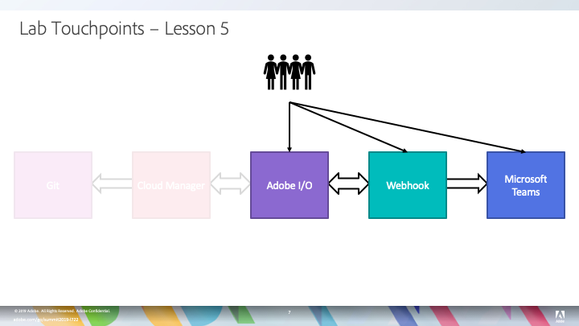

#### Exercise 5.1

> Before proceeding with this exercise, make sure that ngrok is running; the URL generated each time you start ngrok may be different and that URL will be used in this exercise (and the next one). If you need to stop and restart ngrok, you will need to go back to the Adobe I/O console.

The bulk of the real webhook is already written (in the file _webhook.js_ in the same directory opened in the prior lesson in Visual Studio Code). It does need to be configured so that it can invoke the Cloud Manager API *and* so that it can post messages to Microsoft Teams or Slack.

The webhook uses a Node.js library named _dotenv_ to read its configuration. As the name suggests, this library uses a file named _.env_. In Visual Studio Code, click on this file in the Explorer to open it.

> In the actual git project linked to from the [Additional Resources](#additional-resources) section, this file is not provided; the file _.env.template_ is present and needs to be copied to a file named _.env_.


We now need to populate the first handful of lines in this file. To do this, we will register an Integration in the Adobe I/O Console. Before doing that, we need to generate a cryptographic certificate in order to securely sign requests to Adobe I/O.

Select the first Terminal panel (i.e. the one where the webhook is running, not the panel in which ngrok is running) and type Ctrl-C.

```
openssl req -x509 -sha256 -nodes -days 365 -newkey rsa:2048 -keyout private.key -out certificate.crt
```

You'll be prompted here for a series of values. The actual values don't really matter for the purposes of this lab, but you must *at minimum* provide an email address.

Now, switch back to Chrome. Open a new tab and navigate to https://console.adobe.io/

> You shouldn't have to log in, but if you do, use the same credentials as used in Lesson 1.

Click the New integration button.


The integration (which is how Adobe I/O refers to API clients) will both need to receive events and make API calls, so the answer to the question "Do you want to access an API or receive near-real time events" is actually _both_, but Adobe I/O requires this to be a two-step process. Leave _Access an API_ selected (it should be the default) and click Continue.


Select Cloud Manager and click the Continue button.


On the _Create a new integration_ screen, ensure _New integration_ is selected and click the Continue button.


Provide a name and description for your integration.


In the _Public keys certificates_ box, click the _Select a File_ link and open the _certificate.crt_ file created by `openssl`.


Finally, select the _Cloud Manager - Deployment Manager Role_ profile from the product profile list and click the _Create integration_ button.


You'll now see a confirmation screen saying that your integration has been created. Click the _Continue to integration details_ button to see the details of the created integration.


You now need to copy and paste the values for the API Key, Technical account ID, Organization ID, and Client Secret from this screen into the `.env` file in Visual Studio Code. Use the Copy button next to each value (clicking the _Retrieve client secret_ button to show the Client Secret) and paste them into the corresponding variable in the `.env` file.


The `PRIVATE_KEY` variable needs to be set as the value of the generated `private.key` file but *without any line breaks*. There's a helper script which will do this for you. To run this and copy the result to the clipboard, in the terminal panel type:

```
npm run clean-private-key | pbcopy
```
Then you can paste this value into the `.env` file.


#### Exercise 5.2

The next value we need is a webhook URL which will be used to post messages to Microsoft Teams or Slack.

> This part is a bit complicated, but essentially Adobe I/O is going to invoke a webhook on your lab machine which *in turn* will invoke a webhook hosted by Microsoft/Slack.

To start, open [Microsoft Teams](https://teams.microsoft.com/l/team/19%3a5b863af592054aeeb1a626312d632c92%40thread.skype/conversations?groupId=c439f143-e41d-4170-bb84-ee0a79a7e846&tenantId=fa7b1b5a-7b34-4387-94ae-d2c178decee1) 

If you see the _Welcome to Teams! screen (see below), click the _Continue_ button.


To create an Incoming Webhook integration, click the Store icon.


Search for _incoming_ and click on _Incoming Webhook_.


Select _Summit Lab 722_ as the team. Since the connector is already installed, click the _Available_ link.


The webhook should send messages to the General channel by default. On the next screen, click _Set up_.

You need to provide a name for your webhook. Do this with a name based on your attendee number and click the _Create_ button.


You will now see a URL (it will begin with `https://outlook.office.com/webhook/`). Click the button to copy this to the clipboard and click the _Done_ button.


Now switch back to Visual Studio Code and paste the copied URL as the value of the `TEAMS_WEBHOOK` variable in the _.env_ file.


The last value which needs to be populated in the `.env` file is the name of the pipeline you created in Lesson 1. After adding this, make sure save the file in Visual Studio Code.


#### Exercise 5.3

With our webhook fully configured, we can start it and register it with Adobe I/O.

> In order to register a webhook with Adobe I/O, it must be running and, as mentioned in Lesson 4, accessible from the public internet.

To start the webhook, in the terminal panel in Visual Studio Code run

```
npm start
```


Switch back to Chrome (you should still be on the Integration Details page in the Adobe I/O Console) and click the Events tab.

Under the _Add New Event Providers_ section, select Cloud Manager and click the _Add event provider_ button.


Then click the Add Event Registration button.


Provide a name and description for your webhook and as the URL, use the ngrok-generated URL plus `/webhook`, e.g. if ngrok displayed `https://4830004e.ngrok.io`, the webhook URL is `https://4830004e.ngrok.io/webhook`. Adobe I/O registrations can receive multiple types of events (even multiple types of events from different providers). For the purpose of this lab, we only _need_ to subscribe to the _Pipeline Execution Started_ event. Click the checkbox next to this event. Then click the Save button.


If you've entered the URL correctly, the event registration is now Active.


However, if you have entered the wrong URL, you will see a message that the verification has failed. If you see this, click the View button and double check the URL.


## Lesson 6 - Testing it Out

### Objectives

1. Re-Execute the Pipeline
2. Watch Notifications in Microsoft Teams

### Lesson Context

In this last lesson, you will test the process end to end by starting the pipeline in Cloud Manager and, if everything is working correctly, observe the resulting notification in Microsoft Teams.


#### Exercise 6.1

At this point, your webhook and ngrok should be running and registered with Adobe I/O. So now it is time to run the pipeline again. Go back to the Overview page in Cloud Manager, find your pipeline and start it.

#### Exercise 6.2

Depending on how quickly everyone in the lab has reached this step, our Microsoft Teams channel is about to get very noisy. Each pipeline start should result in this kind of notification in the channel:


If you see this notification for your pipeline, feel free to experiment with the webhook (see the [Next Steps](#next-steps) section for some ideas).

If not, you should go back to Lesson 5 and make sure the `.env` file is set up correctly. If you need to change anything in this file, you need to stop the webhook process (using Ctrl-C) and restart it.

Another thing to look at is the Debug Tracing tab in the Adobe I/O console. This will list the requests sent to your webook. To see this information, click the View button for your Event Registration in the console and select the Debug Tracing tab. This will show you the requests made to your webhook by Adobe I/O.


Clicking on one of these entries will show you the headers and body for both the request and response.


If you're still stuck, check with a Lab TA.

## Next Steps

In this lab, we have really just scratched the surface of what can be done with the Cloud Manager API and webhooks. If you've gotten this far and want to experiment some more, here are some ideas of things to try:

> Remember that anytime you change the webhook code or the `.env` file, you need to stop and restart the webhook process, but you shouldn't restart ngrok.

* Change the notification sent to Microsoft Teams when a pipeline is started. Hint: open up `webhook.js` and find where this message is defined.
* Send a message to Microsoft Teams when the pipeline ends. Hint: each time the webhook is invoked, it is passed a JSON object where the `@type` property indicates the event type. The list of event types can be found in the [API Reference](https://www.adobe.io/apis/experiencecloud/cloud-manager/api-reference.html).
* Change the color or title of the notification sent to Microsoft Teams. Hint: the current color is `0072C6`; look for this in `webhook.js`.
* Instead of (or in addition to) Microsoft Teams, send a notification to a different service or even [IFTTT](https://ifttt.com/). Hint: most services (including IFTTT) support the same kind of incoming webhooks as Microsoft Teams, just with a different payload.
* As seen in Lesson 1, CI/CD pipelines in Cloud Manager can be triggered on changes to the git repository.
    * Reconfigure your pipeline (but only your pipeline) to use this trigger and try pushing another change to the project code from Visual Studio Code and see the pipeline re-execute. Hint: You can only edit a pipeline's configuration when it is idle.
    * Add the trigger for the execution to your Microsoft Teams notification. Hint: how an execution was triggered is contained in the API response used to get the execution details and will be either `MANUAL` or `ON_COMMIT`.

## Additional Resources

* To learn more about Cloud Manager, visit https://www.adobe.com/go/aem_cloud_mgr_userguide_en
* To learn more about the Cloud Manager API, visit https://www.adobe.io/apis/experiencecloud/cloud-manager/docs.html
* To see the reference documentation for the Cloud Manager API, visit https://www.adobe.io/apis/experiencecloud/cloud-manager/api-reference.html
* To obtain the source code used in the pipeline lessons, visit https://github.com/adobe/summit2019-l722-lab-project
* To obtain the source code used in the webhook lessons, visit https://github.com/adobe/summit2019-l722-lab-webhook
* To learn more about the `MessageCard` data used for Microsoft Teams notifications, visit https://docs.microsoft.com/en-us/outlook/actionable-messages/message-card-reference.
