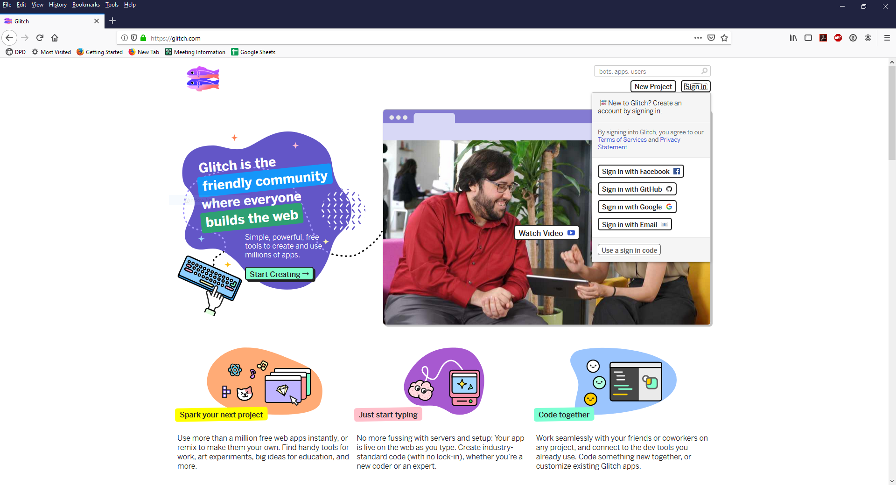
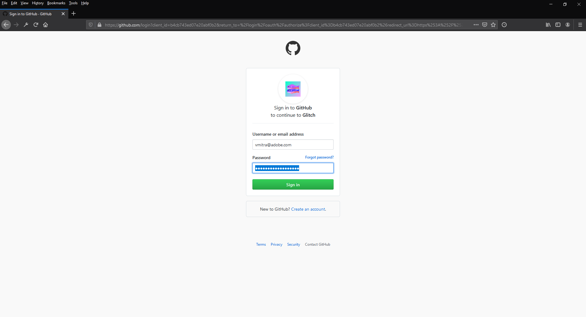
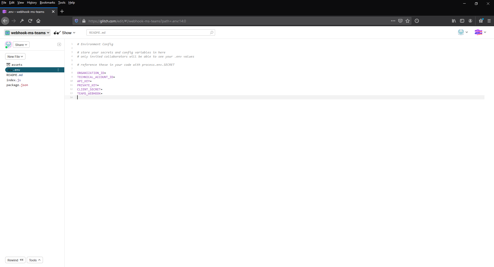
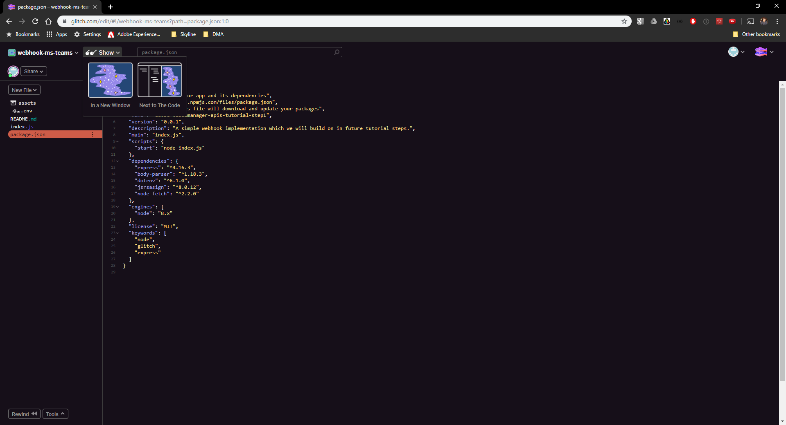
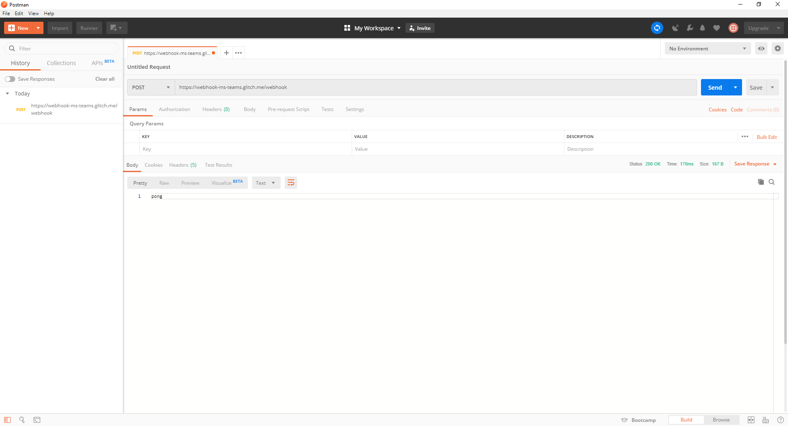

---

# Integrate Cloud Manager with an external system using Adobe I/O.

## Table of Contents

* Lesson 1 - Glitch Setup
* Lesson 2 - Webhook Setup
* Lesson 3 - Testing it Out
* Next Steps

### Scenario Roadmap

In this scenario, we'll be using a number of different tools, so before we get started, let's do a quick overview of what each of these tools does and how we will be using them.

* Cloud Manager
    *  In this scenatio, we'll be setting up a CI/CD pipeline in Cloud Manager and executing it a few times. 
*  Git
   * Git is a version control system. Every Cloud Manager customer is provided with a git repository. This scenario won't be teaching you the ins and outs of using git; just enough to get by. 
* Adobe I/O
    *  Adobe I/O is Adobe's centralized API Gateway through which customers and partners can integrate with the entire Adobe product portfolio. 
* Microsoft Teams
    * Microsoft Teams is a collaboration platform which includes chat (both group and one-on-one), voice, video, and other types of communication.

### Prerequisites

As a LiveTrial attendee, you have been provisioned with all of the necessary access and software needed to participate in this scenario. If you are using this workbook outside of the LiveTrial, you'll need the following:

* Access to Cloud Manager with the Deployment Manager role.
* The System Administrator role for your Organization in the Adobe Admin Console.
* A git client (either the command line client or as part of an Integrated Development Environment).

## Lesson 1 - Glitch Setup

### Objectives

* Setup a Glitch Account

### Lesson Context

In this lesson, we will set up a Glitch Account. [Glitch](https://glitch.com/about/) is a simple tool for creating Web Applications

1. Navigate to https://glitch.com/ 
2. Click ` Sign In `

     > 

3. Select an appropriate Sign In option to create an account. For this exercise we are using ` Sign in with GitHub ` option

    > 

## Lesson 2 - Webhook Setup

### Objectives

1. Run a Simple Webhook
2. Expose the Webhook using Glitch

### Lesson Context

In this lesson, you will run a simple web application which illustrates the type of application typically run to receive events from Adobe I/O. You will also use a tool called [Glitch](https://glitch.com/) to deploy and expose the application to the public internet.

1. Click on bellow button to setup code the webhook within your Glitch Workspace.

   

2. Webhook code should load up in the Glitch IDE
    > 

3. ` .env ` file defines the Environment Configuration i.e. the Client Id, Client Secret, Microsft teams API endpoint etc will be specified here
4. ` index.js ` contains the Webhook code. For more information on creating webhhoks please refer to https://github.com/AdobeDocs/cloudmanager-api-docs/tree/master/tutorial
5. ` package.json ` defines the build profiles and dependencies.
6. To test the Webhook, simply click the ` Show ` button and select ` In a New Window `

    > 

7. You should see an output like this

    > 

8. Copy the Webhook URL from the address bar and using CURL or Postman run: ` run curl -X POST <Webhook URL>/webhook `

     > 

9. 

