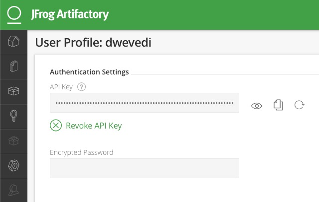
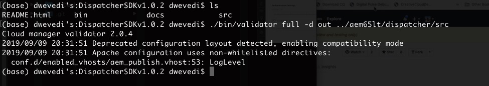

# Using Dispatcher Configuration Validator


## Table of Contents

  
  - [Table of Contents](#table-of-contents)
  - [Scenario Overview](#scenario-overview)
  - [Key Takeaways](#key-takeaways)
 - [Pre-requisites](#pre-requisites)
  - [Lesson 1 - Setting up Docker](#lesson-1---setting-up-docker)
  - [Lesson 2 - Setup Dispatcher SDK Validator](#lesson-2---setup-dispatcher-sdk-validator)
  - [Lesson 3 - Run Dispatcher SDK Validator](#lesson-3---run-dispatcher-sdk-validator)


## Scenario Overview
The Dispatcher SDK provides:

* Dispatcher Configuration : a vanilla file structure containing the configuration files to include in a maven project for dispatcher
* Dispatcher Validator: tooling for customers to validate a dispatcher configuration locally
* Dispatcher Docker Image: a Docker image that brings up the dispatcher locally

The validation tool is available in the SDK as a macOS or Linux binary.

It allows customers to run the same validation that Cloud Manager will perform while building and deploying a release.

### Key Takeaways

* Setup Dispatcher SDK Validator
* Use Dispatcher SDK Validator to validate dispatcher Configureations


### Pre-requisites

* AEM Project with Dispatcher Configurations

## Lesson 1 - Setting up Docker

1. Install Docker for Mac (https://docs.docker.com/v17.12/docker-for-mac/install/) or to Windows (https://docs.docker.com/v17.12/docker-for-windows/install/)

2. **[INTERNAL ONLY]** SSO to https://artifactory-uw2.adobeitc.com and create an API key that will be used in the next section
3. To create an API key, click on your user name on the top right 
Onthe profile
4. create a new API key. 



```
docker login docker2-granite-release-local.dr-uw2.adobeitc.com 
Username : <ldapid>
Password: < Paste Token >

```
## Lesson 2 - Setup Dispatcher SDK Validator

1. Copy DispacthcerSDKv1.0.2sh to a folder
2. Open Terminal in the folder and add executable permission to .sh file
```
chmod +x DispacthcerSDKv1.0.2sh
```


## Lesson 3 - Run Dispatcher SDK Validator

1. Put your project in the folder ( OR you change Project directory in following command)
2. Run Validator by executing following command

```
./bin/validator full -d out ~/AEMProjectDirectory/dd-dispatcher/src

```

You should get following 


Step 2. If needed make changes to dispatcher configurations and Re-run step 6.